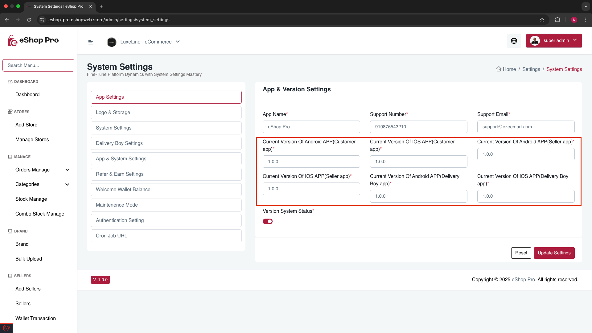

# Configure Force Update

If you want to force users to update to the latest app version, you can enable the Force Update feature in the admin panel.

1. **Go to admin panel:**
   - Navigate to Settings -> System Settings -> App Settings
   - Enable Version System Status

   

2. **Get the version number:**
   - In your app code, go to `pubspec.yaml`
   - Copy the version number of the application

   

3. **Configure versions:**
   - Enter the copied version number into Android and iOS Version fields
   - Note: If you have different versions for Android and iOS apps, enter the version numbers accordingly
   - Repeat this process for Customer, Seller, and Delivery Boy apps

   