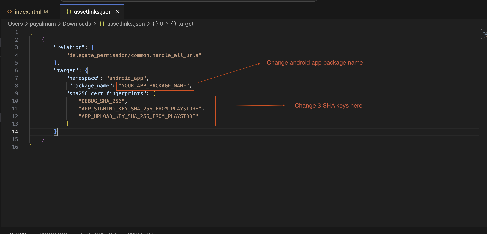
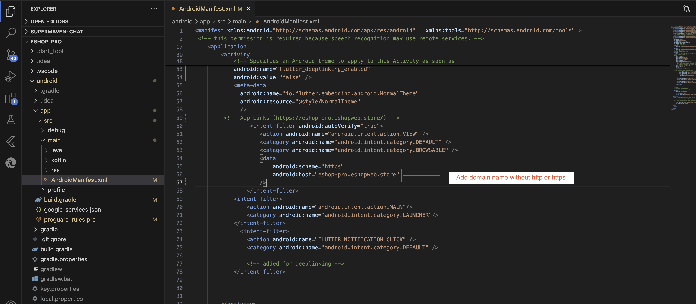
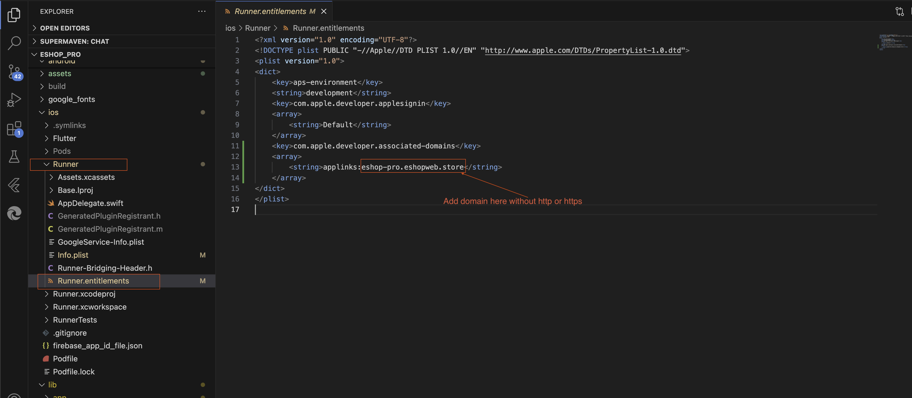

# Deeplink Setup

To set up deeplinks in your application, follow these steps:

1. Download server-side deeplink files from [Google Drive](https://drive.google.com/drive/folders/1huTiJ6RwnETJq1arz7zVKUosoffoPvPk?usp=sharing)

2. Open both files in a text editor and make the necessary changes

   
   

3. Save both files without changing their name and extensions

4. On the server:
   - Go to admin panel root folder
   - Look for `.well-known` folder
   - If not found, create it (name must start with dot[.])
   - Add both saved files to the `.well-known` folder and make them public

5. In the server's admin panel root folder:
   - Open `.htaccess` file
   - Add the following code:
   ```apache
   # 300 Redirections 
   
   # Redirect for Android devices 
   RewriteCond %{HTTP_USER_AGENT} (Android) [NC] 
   RewriteRule ^.*/provider/.*$ https://play.google.com/store/apps/details?id=com.wrteam.eshop.pro [R=301,L] 
   
   # Redirect for iPhone/iPad devices 
   RewriteCond %{HTTP_USER_AGENT} (iPhone|iPad) [NC] 
   RewriteRule ^.*/provider/.*$ https://testflight.apple.com/join/ZqKwNk27 [R=302,L]
   ```

6. Update the URLs in the code:
   - Replace the Play Store URL with your android app's URL
   - Replace the App Store URL with your IOS app's URL

7. In the customer app code:

   
    