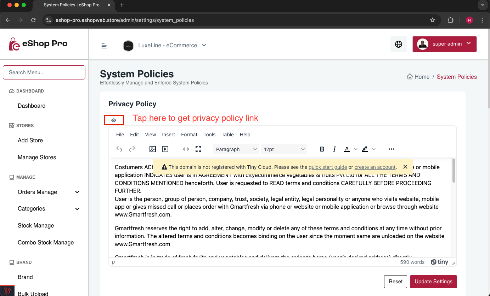
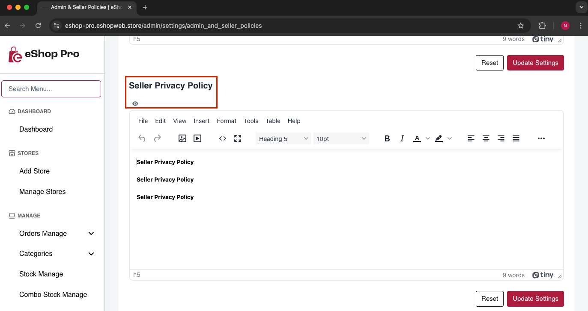
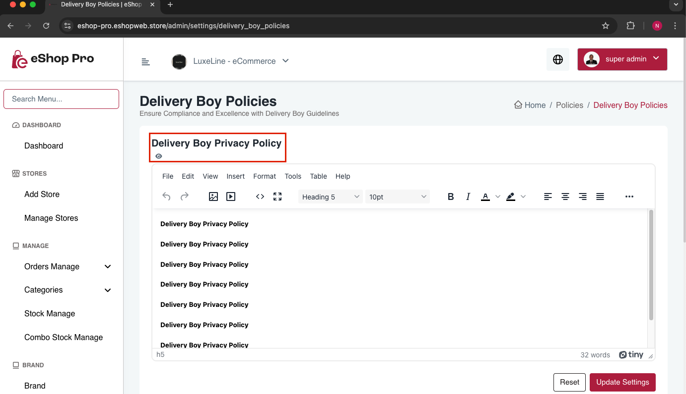

# Get Privacy Policy URL for PlayStore

To get the Privacy Policy URLs for different apps, follow these steps:

1. Open admin panel and go to Settings

2. **For Customer App:**
   - Navigate to `System Policies`
   - Look for `Privacy Policy`

   

3. **For Seller App:**
   - Navigate to `Admin & Seller Policies`
   - Look for `Seller Privacy Policy`

   

4. **For Delivery Boy App:**
   - Navigate to `Delivery Boy Policies`
   - Look for `Delivery Boy Privacy Policy`

   