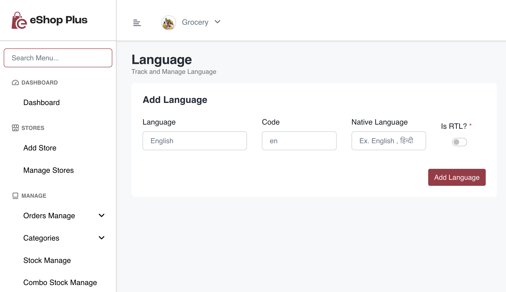
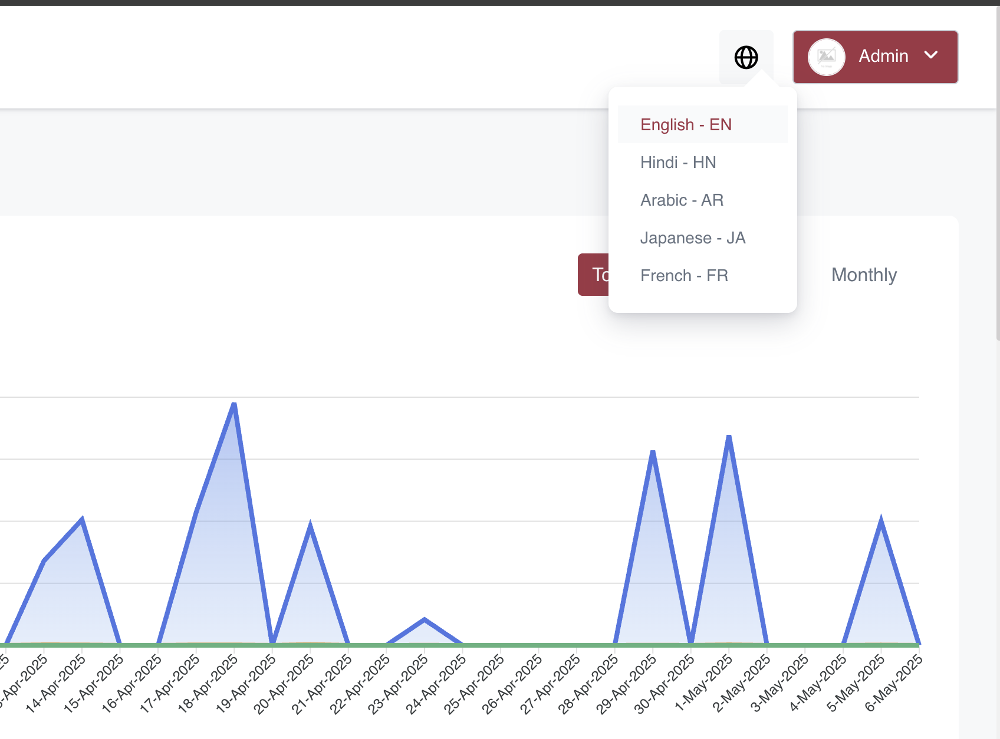
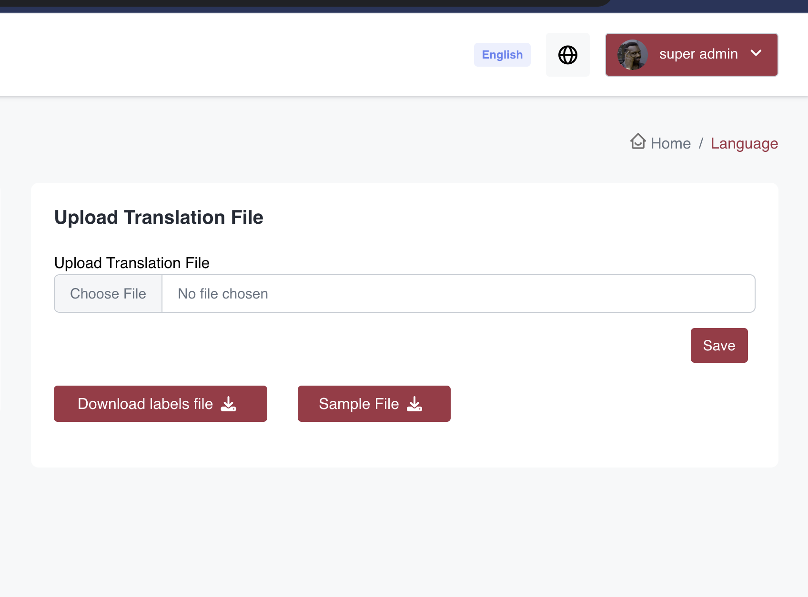

# Add Language

To add a new language to your application, follow these steps:

1. Open admin panel and navigate to Language section

2. Add the new language:
   - Enter the language name, code and name in native language 
   - Enable 'is RTL' if the language reads right-to-left

   

3. After adding the language, you'll have to upload the translation file for the new language

4. First select the language you want to add translation file from the dropdown menu of top bar

  

5. Add translations:
   - Download the labes file fron 'Download labels file' button
   - Then download the sample file and add each label from labels file with label key => translated value in sample file
   - And upload translated  file 

   

Note: Make sure to provide accurate translations for all labels to ensure proper localization of your application.