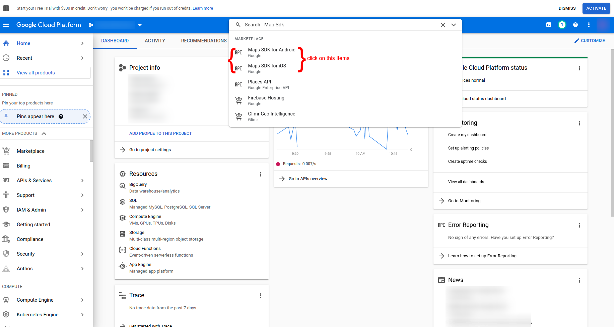
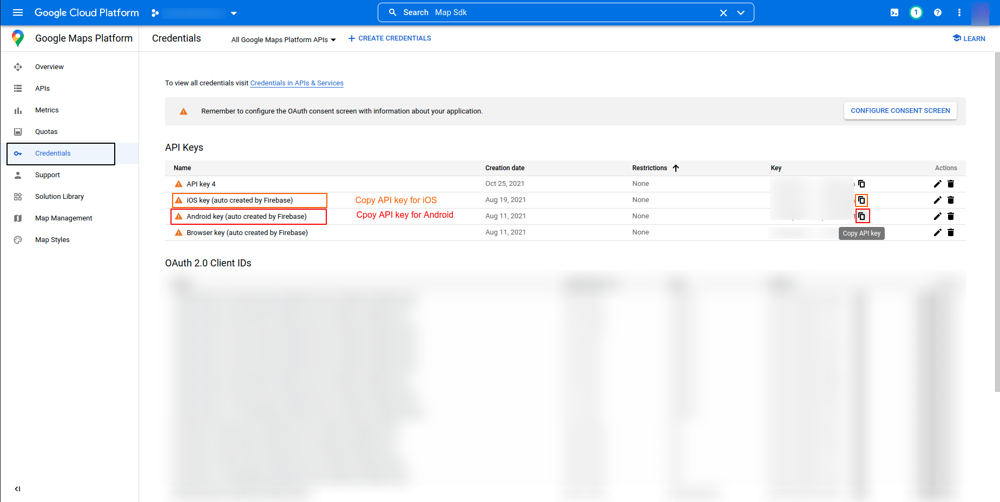
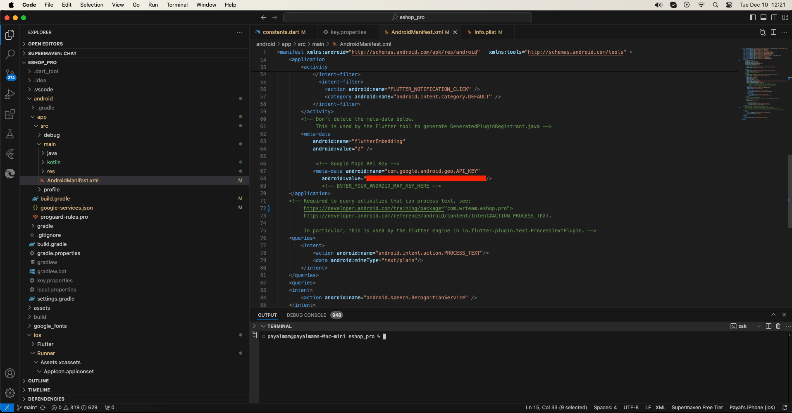
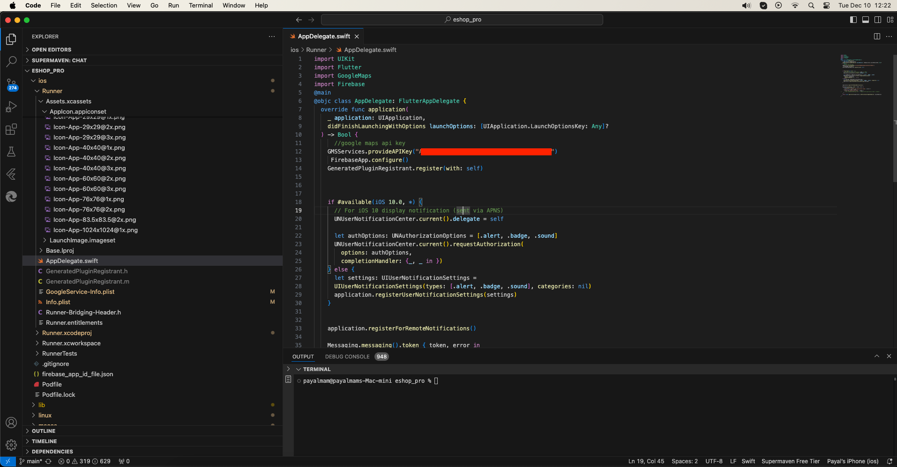
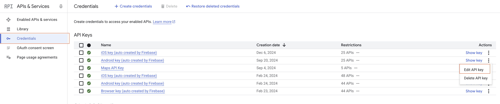
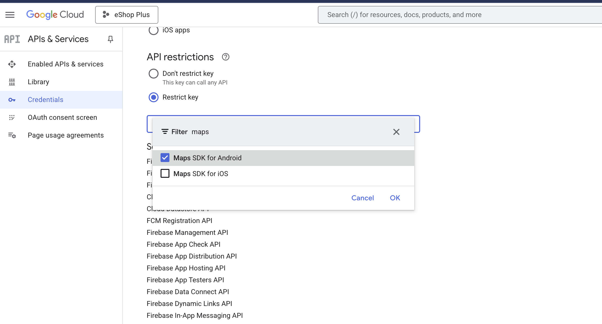

# Add Map API Key for Address

To add Google Maps API key for address functionality, follow these steps:

1. Go to [Google Cloud Platform](https://cloud.google.com/)
   

2. Select your Firebase Project
   

3. Enable the following APIs:
   - Maps SDK for Android
   - Maps SDK for iOS
   - Maps Embed API  
   - Geocoding API
   - Geolocation API
   
   
   

4. Get your API keys from the Credentials tab
   

5. Configure the API keys:

   For Android:
   - Open `android/app/src/main/AndroidManifest.xml`
   - Add the following in the application tag:
   ```xml
   <meta-data android:name="com.google.android.geo.API_KEY"
       android:value="YOUR_API_KEY_HERE" />
   ```
   

   For iOS:
   - Open `ios/Runner/AppDelegate.swift`
   - Add the following line:
   ```swift
   GMSServices.provideAPIKey("YOUR_API_KEY_HERE")
   ```
    

6. If you face issue in loading map, then you can check the following steps:
   - Open [Google Cloud Platform](https://cloud.google.com/)
   - Select your Firebase Project
   - Go to APIs & Services -> Credentials
   - Click on Edit key for Android and iOS
   - Then check in the `API key restrictions` section
   - If you see `Restrict key` then check the APIs you have enabled in first step are selected or not
   - If not then select them and save

   
   

   

   For Android key add APIs: 
   - Maps SDK for Android
   - Maps Embed API
   - Geocoding API
   - Geolocation API

   For iOS key add APIs:   
    - Maps SDK for iOS
    - Maps Embed API
    - Geocoding API
    - Geolocation API

   Note : After adding APIs, it may take some time to reflect in the platform.

   