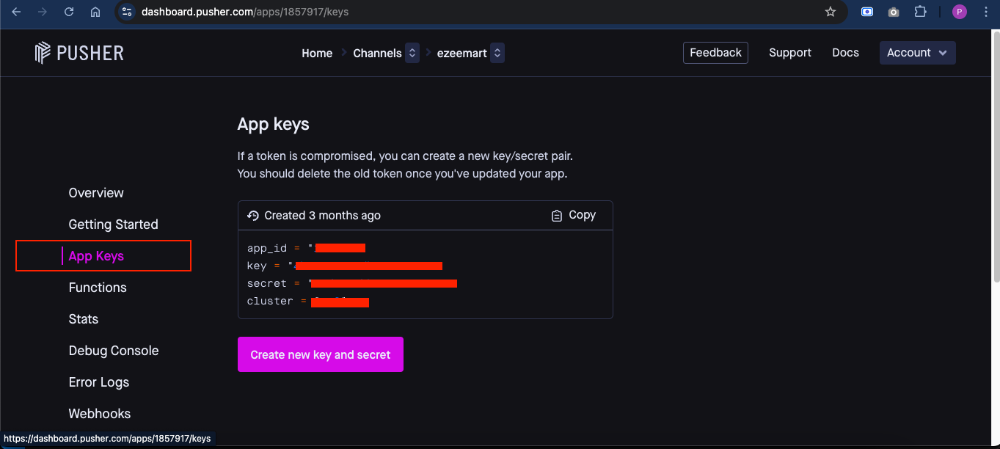
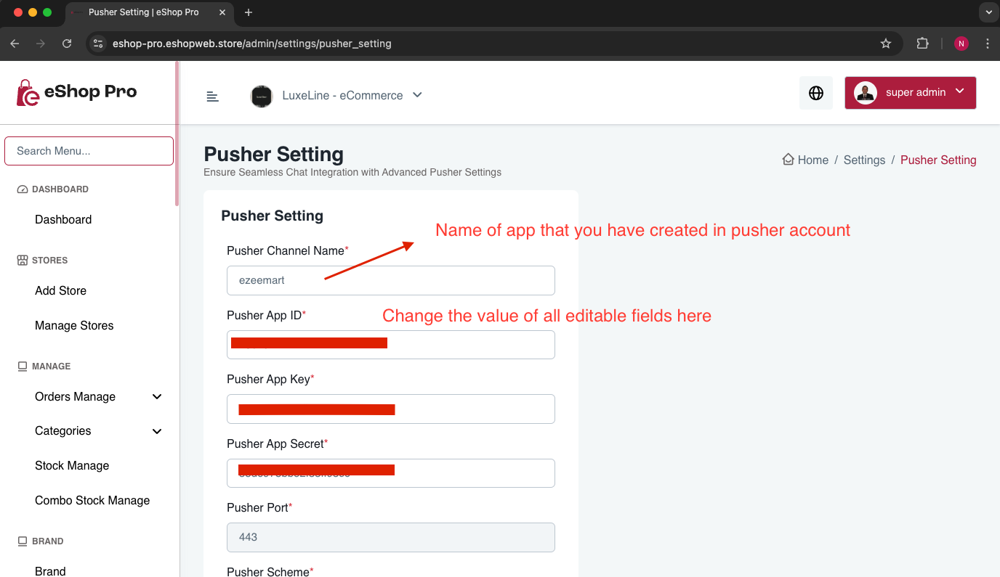

# Add Pusher Info for Chat Feature

To set up Pusher for the chat feature, follow these steps:

1. Create an account at [Pusher](https://pusher.com/)

2. After creating your account:
   - Go to [Pusher Dashboard](https://dashboard.pusher.com)
   - Navigate to [Apps Section](https://dashboard.pusher.com/apps)
   - Click on "Create app" and follow the setup process

3. Once your app is created:
   - Select your app from the dashboard
   - Go to "App Keys" section
   - Copy the following values:
     - App ID
     - Pusher Key
     - Pusher Secret Key
     - Cluster

   

4. Configure Admin Panel:
   - Open admin panel
   - Go to Settings -> Pusher Setting
   - Enter the following details in their respective fields:
     - Channel Name
     - App ID
     - Pusher Key
     - Pusher Secret Key
     - Cluster

   

Note: Make sure all values are correctly copied and pasted to ensure proper functionality of the chat feature.