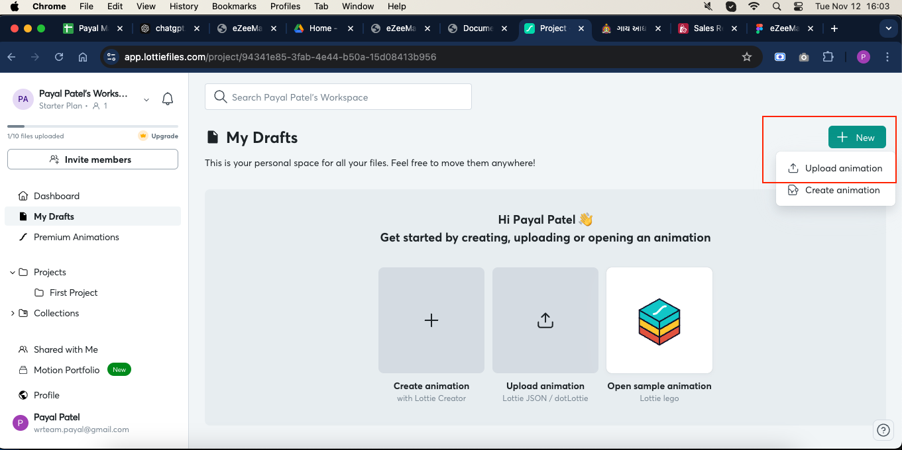
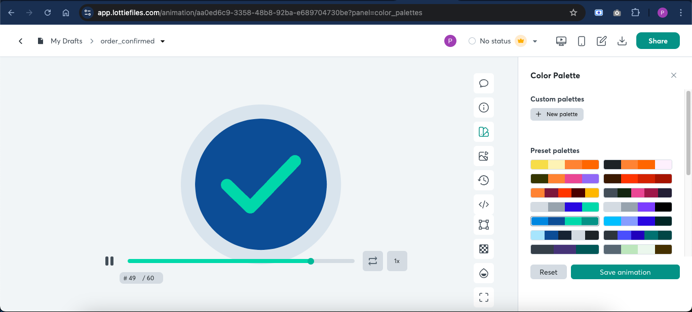

# Change Animation color

If you want to change the animation color then follow the below steps:

1. Open website [LottieFiles](https://lottiefiles.com) in browser and login or signup.

2. Upload `order_confirmed.json` file from `assets->images` folder of app code.

   

3. After uploading the file, you can change the color of animation from color pallete.

4. After changing the color, you can download the json file and replace the file in `assets->images` folder of app code.

5. After replacing the file, you can see the animation color changed. You can repeat the steps for all lotties images of the app of which you want to change the color.

   

