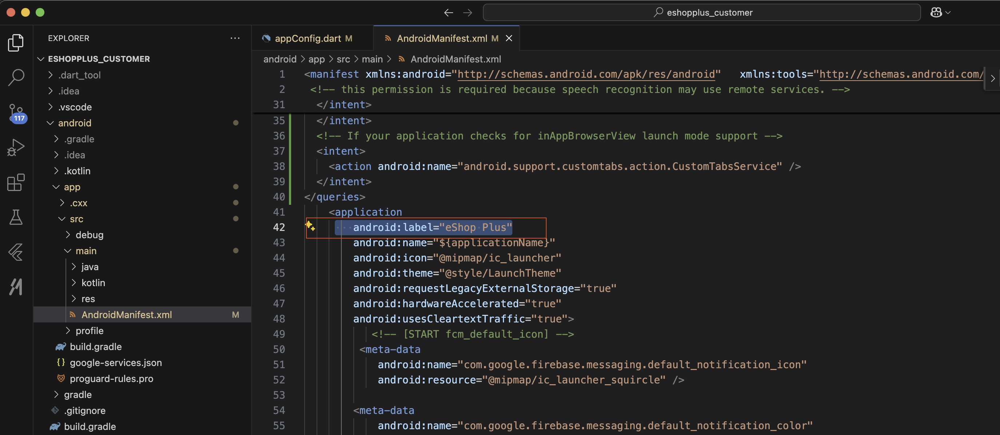
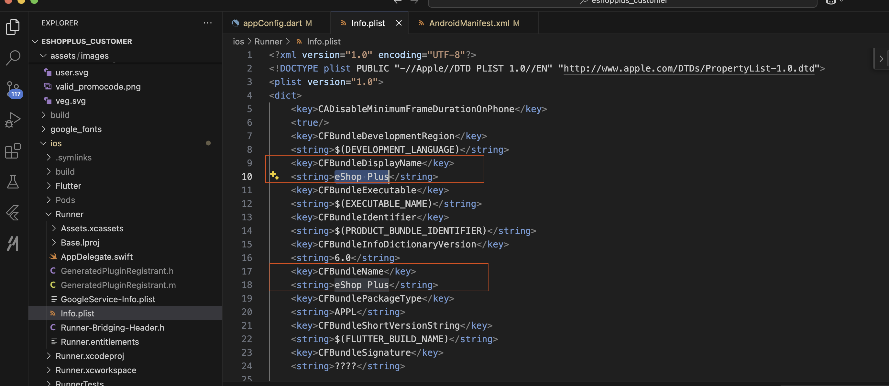
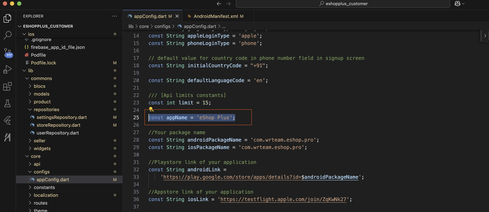

# Change App Name

### Android Configuration

1. Navigate to `android/app/src/main/AndroidManifest.xml`
2. Change the app name by modifying the `android:label` value in the application tag

### iOS Configuration

1. Navigate to `ios/Runner/Info.plist`
3. Change the app name by modifying the  `CFBundleDisplayName` and  `CFBundleName` value

### Change app name in code

1. Open `lib/core/configs/appConfig.dart`
2. Change the value of `appName` variable with your desired app name

