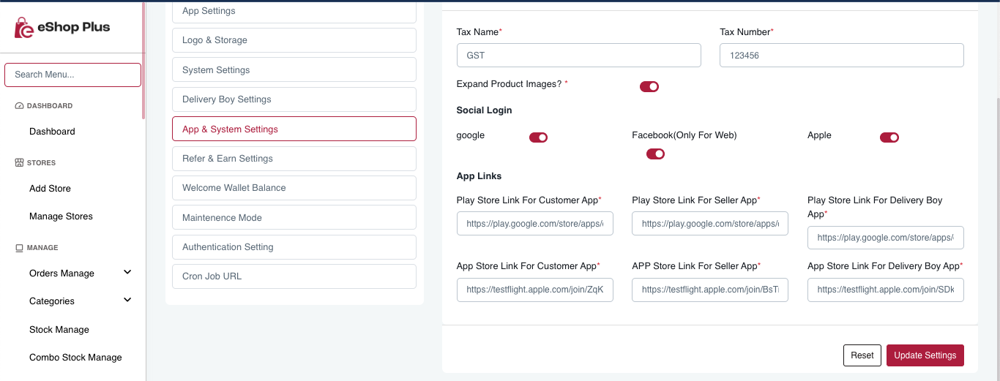

# Change apps links 

To change the Playstore and Appstore link of apps

1. Open admin panel
2. Go to Settings -> System Settings -> App and System Settings
3. There you can set the store link for Play store and App Sotre for all 3: Customer, Seller and Delivery Boy apps.

