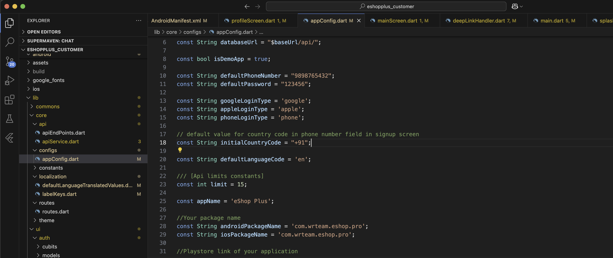

# Change Default Country Code for OTP

To change the default country code for OTP verification, follow these steps:

1. Open `lib/core/configs/appConfig.dart`

2. Locate the default country code setting and replace it with your desired country code:

   

4. Save the file and rebuild the application:
