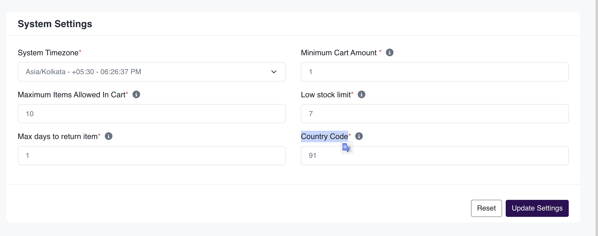
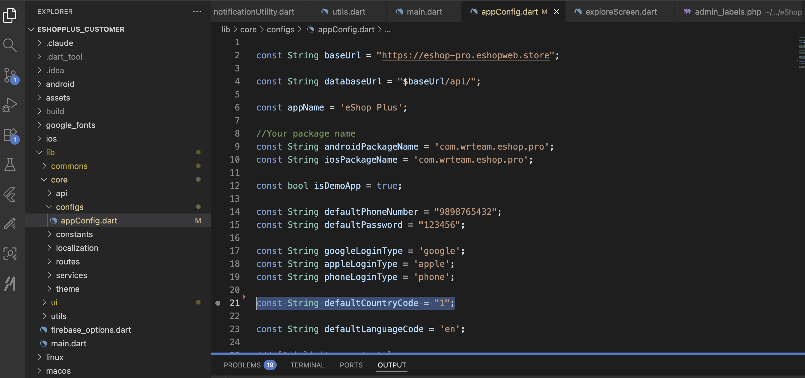

# Change Default Country Code for OTP

To change the default country code open the Admin panel. Go to Settings => System Settings. Change the value in Country Code field:
 

For fallback purposes (when Country code not getting from backend), you can also change the default country code in the `appConfig.dart` file:
1. Open `lib/core/configs/appConfig.dart`

2. Replace defaultLanguageCode  with your desired country code:

   

4. Save the file and rebuild the application:
