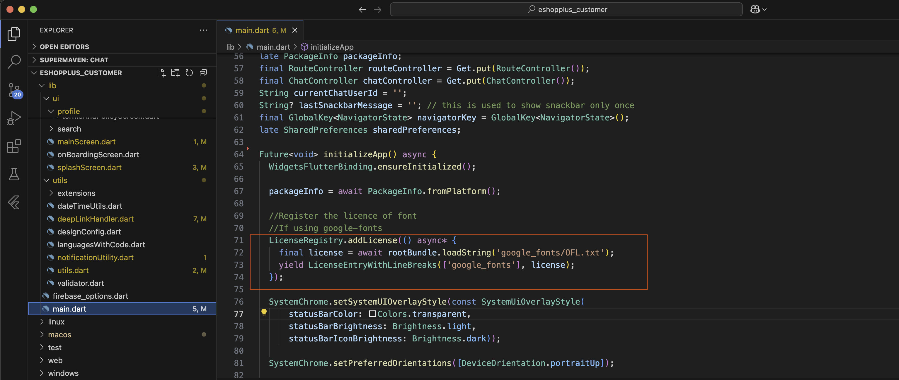
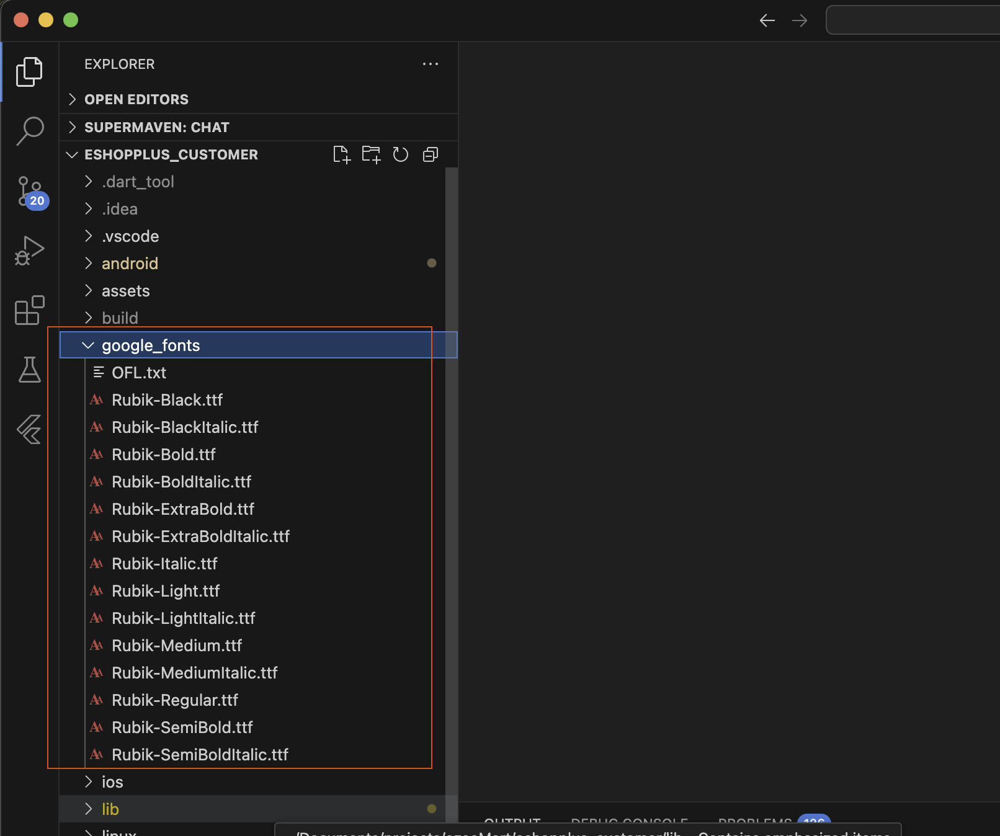

# Change Font

To change the font in your application, follow these steps:

1. Go to `lib/main.dart` and add your font as shown in the image below.

   

2. Go to `google_fonts/` and add `.tff` files of fonts.

   