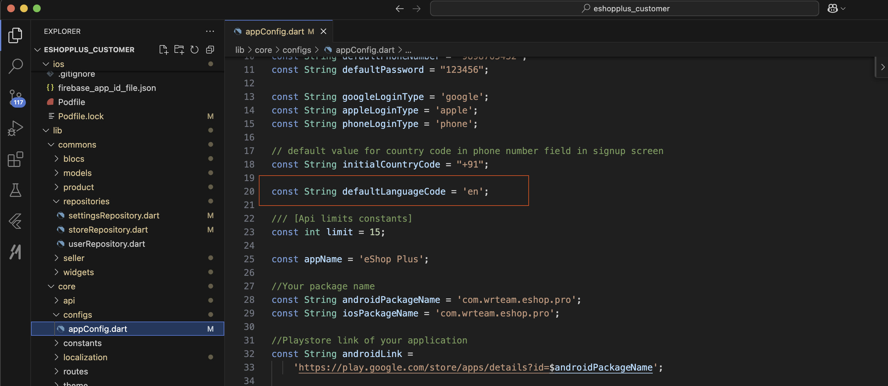

# Change Default Language of App

By default, the application language is English. To change the default language, follow these steps:

1. Go to `lib/core/configs/appConfig.dart`
2. Add your respective language code as shown in the image below
3. You can find your language code from [Google's Language Code Reference](https://developers.google.com/admin-sdk/directory/v1/languages)

