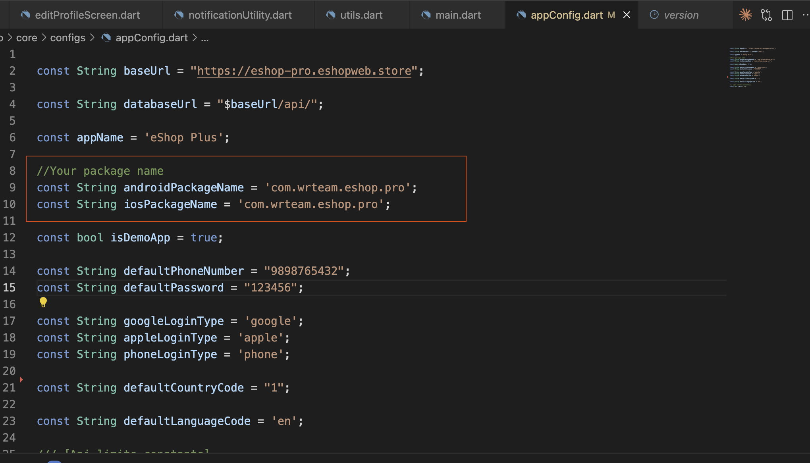

# Change Package Name

Please visit our [Change Package Name Documentation](https://wrteam-in.github.io/common_app_doc/GeneralSettings/packagename) for detailed instructions on changing the package name.

After changing the package name, you need to change the package name in the app code.

### Change Package Name in app code

1. Open `lib/core/configs/appConfig.dart`

2. Replace `packageNames` with your new package name:

   

3.  Save the file and rebuild the application:
