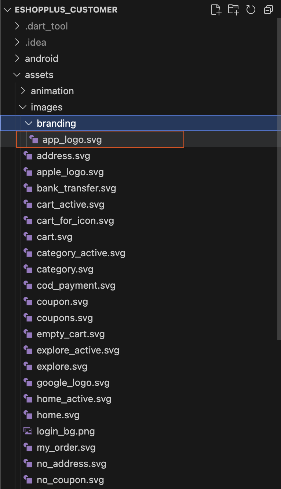

# Change Primary Color & Splash Screen Logo

You can customize the app’s primary color and splash screen logo to match your brand. Follow these steps:

1. **Change Primary Color:**
   - Open `lib/core/theme/colors.dart` in your Flutter project.
   - Update the value of `primaryColor` to your desired color code.
   - If your app uses SVG images with the old primary color (default: `#B52046`), search for this color code throughout your project and replace it with the new one to ensure consistency.

2. **Update Splash Screen Logo:**
   - Go to `assets/images/branding/`.
   - Replace the existing splash screen logo with your new logo, keeping the filename the same as the original.

