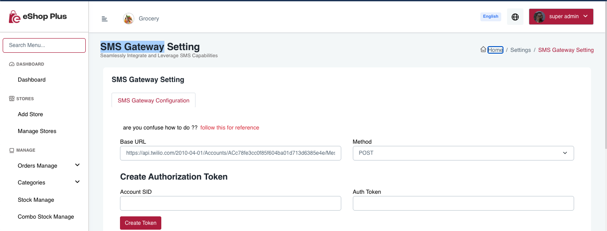

# Change Authentication Method

You can change the authentication method for OTP verification. The app supports both Firebase authentication and Custom SMS Gateway.

1. Open admin panel
2. Go to Settings -> Authentication Setting
3. Select your preferred authentication method

Note: By default Firebase authentication method is enabled.

4. If you want to use Custom SMS Gateway, then you need to configure the necesary details in Settings -> SMS Gateway Setting:

