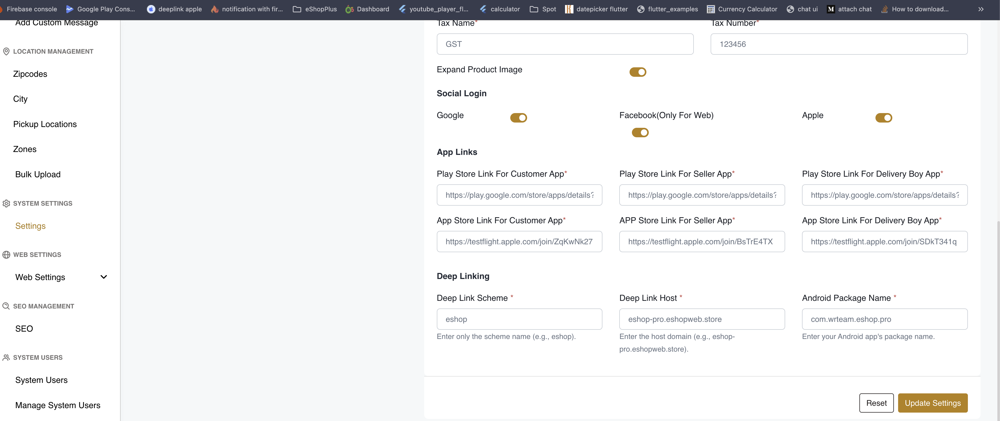
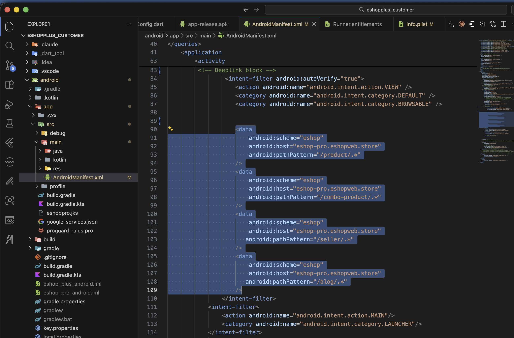
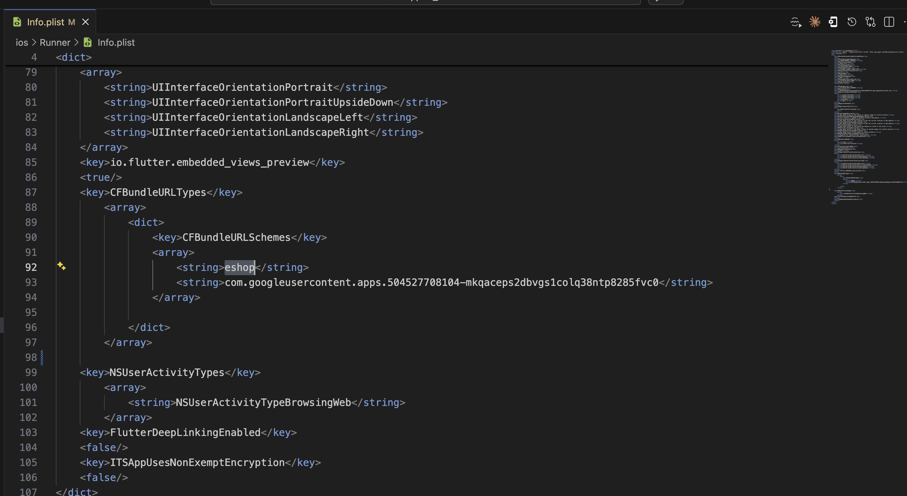
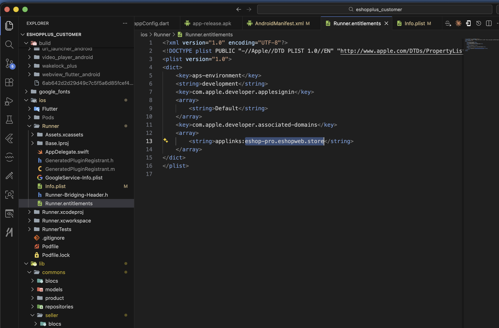
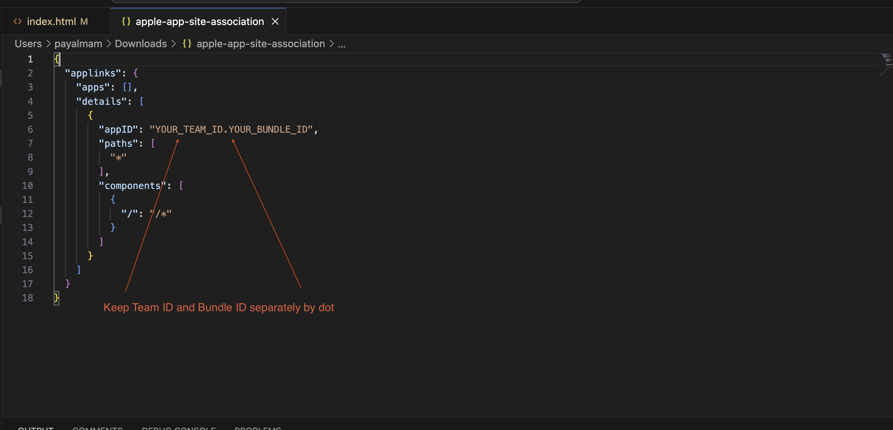
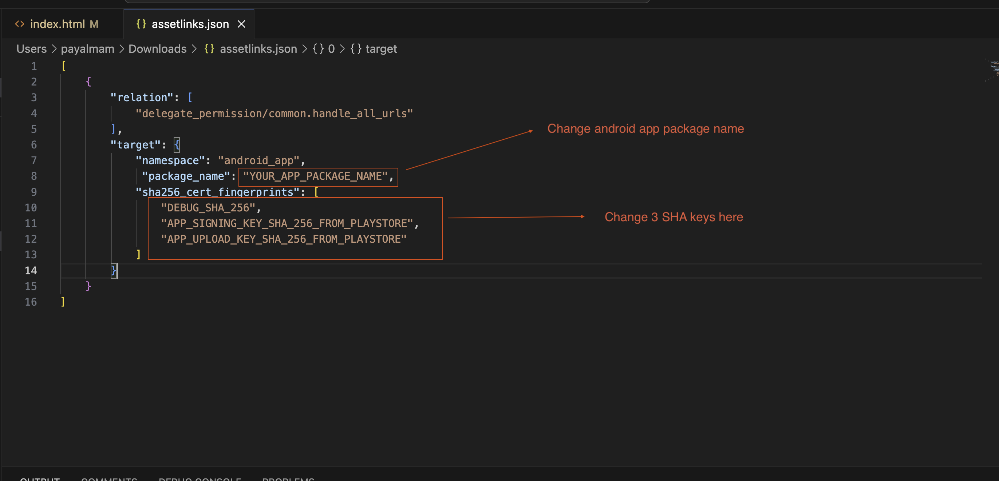
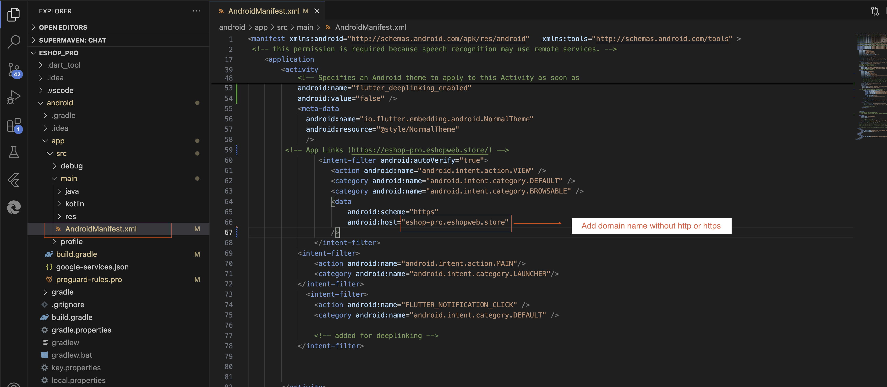
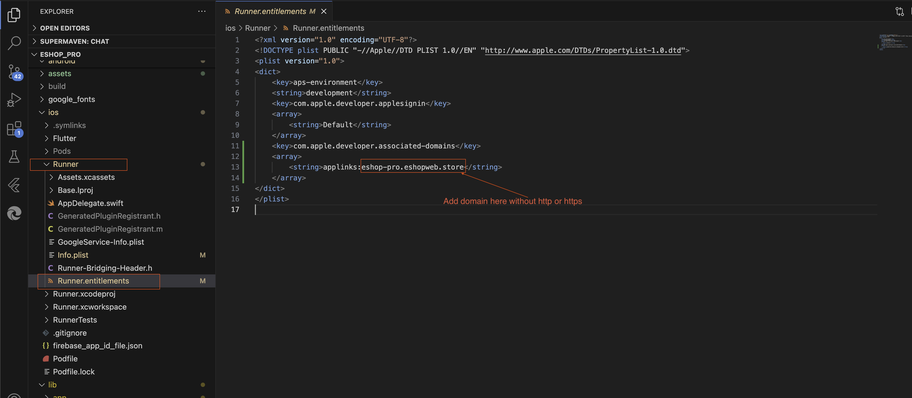

# Deeplink Setup

The deeplink setup process differs based on your eShop Plus version. Choose the appropriate guide for your version:

## Version 1.1.0+

eShop Plus version 1.1.0 introduces an improved deeplink setup process. Follow these updated steps:

### Step 1: Configure Deep Link Credentials in Admin panel
**Path:** `Settings -> System Settings -> App Settings`

In Deep Linking section, you need to add three pieces of information:
- **Deep Link Scheme** - This is the protocol identifier for your app (e.g., `myapp`)
- **Deep Link Host** - This is the domain or host identifier for your deeplinks (e.g., `deeplink.myapp.com`)
- **Android Package Name** - This is your Android app's package name (e.g., `com.example.myapp`)

These credentials ensure that deeplinks are properly routed to your application on both Android and iOS devices.



### Step 2: Update Android Manifest File

In your customer app, navigate to the Android configuration file:

**File Path:** `android/app/src/main/AndroidManifest.xml`

Inside the `Deeplink` block (intent-filter), update the following attributes:
- Change the `android:scheme` attribute to match your configured **Deep Link Scheme**
- Change the `android:host` attribute to match your configured **Deep Link Host**
- **Important:** Do not change the `android:pathPattern` attribute - keep it as configured

**Example:**
```xml
<intent-filter>
    <action android:name="android.intent.action.VIEW" />
    <category android:name="android.intent.category.DEFAULT" />
    <category android:name="android.intent.category.BROWSABLE" />
    <data 
        android:scheme="myapp"
        android:host="deeplink.myapp.com"
        android:pathPattern="/.*" />
</intent-filter>
```



### Step 3: Update iOS Configuration Files

#### 3a. Update Info.plist File

**File Path:** `ios/Runner/Info.plist`

Locate or create the `CFBundleURLSchemes` key. Add your **Deep Link Scheme** to the array:

```xml
<key>CFBundleURLSchemes</key>
<array>
    <string>myapp</string>
</array>
```

This allows your app to check if the deeplink scheme can be opened on the device.



#### 3b. Update Runner.entitlements File

**File Path:** `ios/Runner/Runner.entitlements`

Add your **Deep Link Host** to the associated domains entitlement:

```xml
<key>com.apple.developer.associated-domains</key>
<array>
    <string>applinks:deeplink.myapp.com</string>
</array>
```

This enables Universal Links on iOS and associates your app with the specified deeplink host.



---

## Version 1.0.x (Older Versions)

To set up deeplinks in your application for older versions, follow these steps:

1. Download server-side deeplink files from [Google Drive](https://drive.google.com/drive/folders/1huTiJ6RwnETJq1arz7zVKUosoffoPvPk?usp=sharing)

2. Open both files in a text editor and make the necessary changes

   
   

3. Save both files without changing their name and extensions

4. On the server:
   - Go to admin panel root folder
   - Look for `.well-known` folder
   - If not found, create it (name must start with dot[.])
   - Add both saved files to the `.well-known` folder and make them public

5. In the server's admin panel root folder:
   - Open `.htaccess` file
   - Add the following code:
   ```apache
   # 300 Redirections 
   
   # Redirect for Android devices 
   RewriteCond %{HTTP_USER_AGENT} (Android) [NC] 
   RewriteRule ^.*/provider/.*$ https://play.google.com/store/apps/details?id=com.wrteam.eshop.pro [R=301,L] 
   
   # Redirect for iPhone/iPad devices 
   RewriteCond %{HTTP_USER_AGENT} (iPhone|iPad) [NC] 
   RewriteRule ^.*/provider/.*$ https://testflight.apple.com/join/ZqKwNk27 [R=302,L]
   ```

6. Update the URLs in the code:
   - Replace the Play Store URL with your android app's URL
   - Replace the App Store URL with your IOS app's URL

7. In the customer app code:

   
    

---

