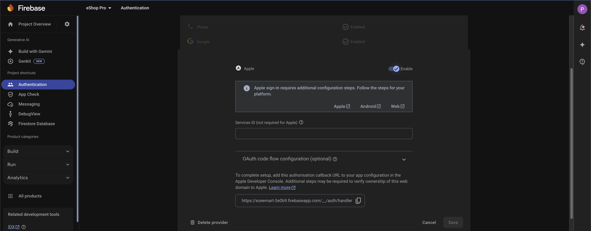
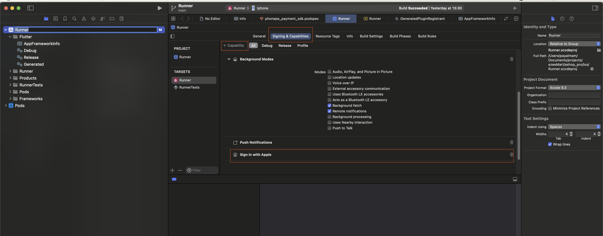
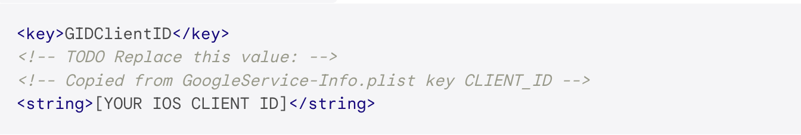
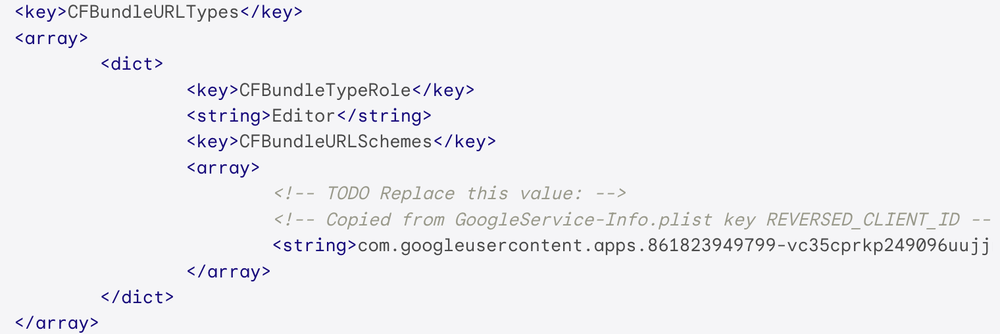

# Enable Apple Authentication

Follow these steps to enable Apple Authentication:

1. Open your Firebase console
2. Go to Authentication and open Sign-in method
3. Navigate to Apple section and enable Apple sign-in
4. Click 'Save'

## Xcode Configuration

1. In Xcode:
   - Select the Signing & Capabilities tab
   - Add "Sign In With Apple" as a new Capability
   - Select a team in the Code Signing section

## Mandatory iOS Configuration

1. Open `ios/Runner/Info.plist` in your code editor

2. Add the client ID from GoogleService-Info.plist to your Info.plist file:

   

3. Update the CFBundleURLTypes attributes in the Info.plist file:

   