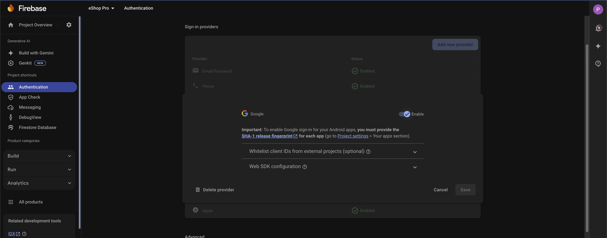
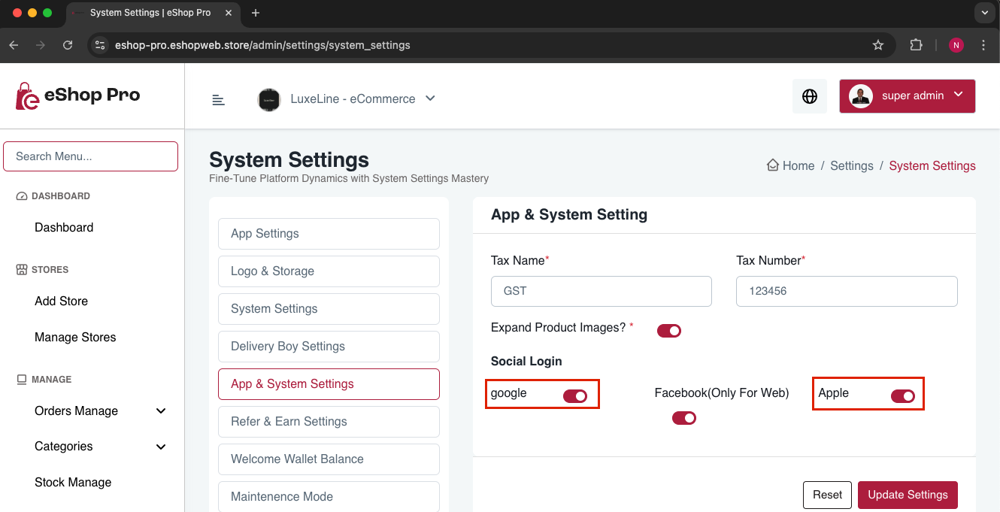

# Enable Google Authentication

Follow these steps to enable Google Authentication:

1. Open your Firebase console
2. Go to Authentication and open Sign-in method
3. Navigate to Google section
4. Enable Google sign-in and click 'Save'

## Enable/Disable Authentication Methods

You can enable or disable Google and Apple sign-in options from the admin panel:

1. Go to Settings -> System Settings -> App & System Setting
2. Toggle the authentication options as needed

