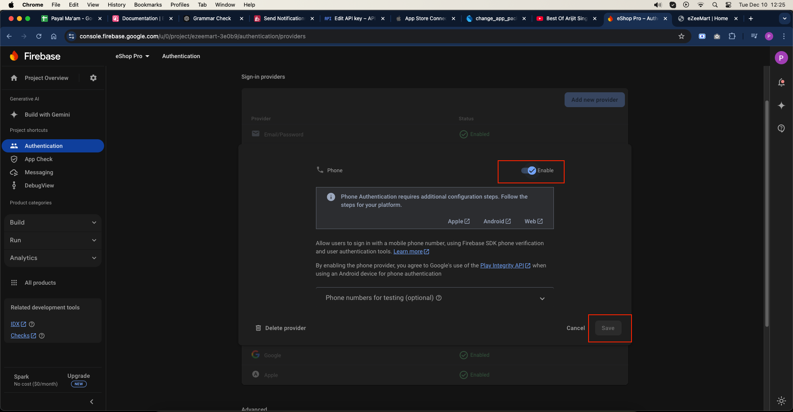

# Enable Firebase Phone Authentication (OTP)

Follow these steps to enable Phone Authentication:

1. Open your Firebase console
2. Go to Authentication and open Sign-in method
3. Enable Phone Sign-in method and click 'Save'

