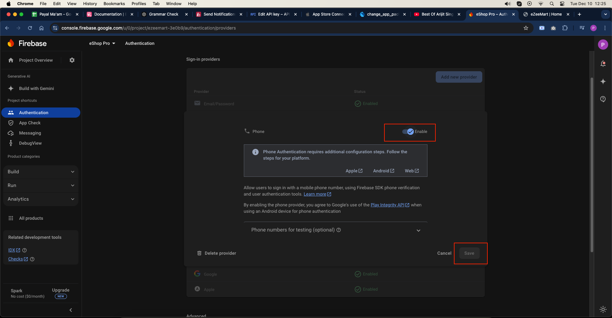

# Enable Firebase Phone Authentication (OTP)

Follow these steps to enable Phone Authentication:

1. Open your Firebase console
2. Go to Authentication and open Sign-in method
3. Enable Phone Sign-in method and click 'Save'

Refer [Firebase Setup Documentation](https://www.marketplace.wrteam.in/docs/flutter-common-doc/GeneralSettings/firebase) for other settings which is required for Phone authentication