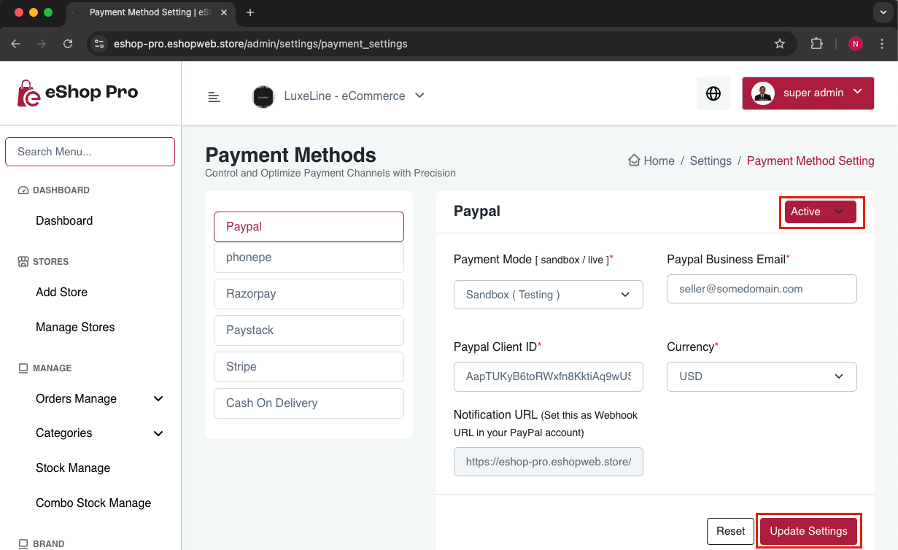

# Manage Payment Gateway and Credentials

Follow these steps to manage payment gateway settings in the admin panel:

1. Open admin panel
2. Go to Settings > Payment Methods Settings
3. Here you can:
   - Activate or deactivate payment methods
   - Configure all necessary payment information for active methods in the respective fields

