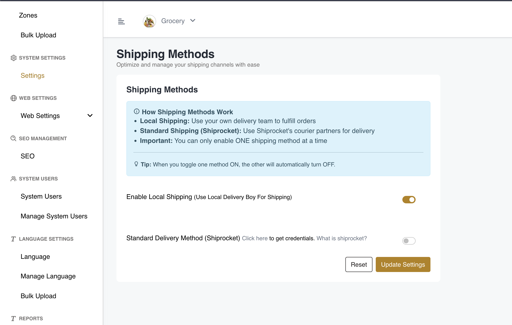

# Manage Shipping Methods

Follow these steps to configure and manage shipping methods in your eShop Plus admin panel:

## Path to Shipping Settings

Navigate to the shipping settings page using the following path:

**Settings → Shipping Settings**

Or directly access it at:
```
https://your-admin-url/admin/settings/shipping_settings
```

## Available Options

In the Shipping Settings, you can choose and configure your preferred shipping methods and options according to your business requirements

1. Local Shipping (Use Local Delivery Boy For Shipping)
2. Standard Delivery Method (Shiprocket)



