import Tabs from '@theme/Tabs';
import TabItem from '@theme/TabItem';

  <h1>üöÄ eShop Plus Features</h1>
  
Discover the comprehensive features and capabilities that make eShop Plus the ultimate eCommerce solution for modern businesses.

  <h2>üè™ Store Management</h2>
  
  <ul className="feature-list">
    <li>If you have multiple businesses like grocery, pharmacy, furniture, or clothing, you can add multiple stores and manage them efficiently.</li>
    <li>You can define store colors, display styles for the web and app, and configure deliverability settings.</li>
    <li>You can check the deliverability flow here: <a href="https://docs.google.com/document/d/1khOpdQ2kfwd_cbX9b2GlxTkqMxA3NThl0oyj0kP4NsQ/edit?tab=t.0" className="link-button">Product deliverability flow</a></li>
    <li>Additionally, you can edit, activate, or deactivate a store as needed.</li>
    <li>The entire system is store-based, so adding a store is mandatory.</li>
  </ul>

  <h2>📦 Orders Management</h2>
  
  <ul className="feature-list">
    <li>Only sellers can ship orders. Admin has no rights to edit orders.</li>
    <li>
      The Seller Panel contains two main tabs:
      <ul>
        <li>Order Items tab - Shows all items for your orders</li>
        <li>Shipments tab - Contains "Create a Parcel" button and Created Parcels List</li>
      </ul>
       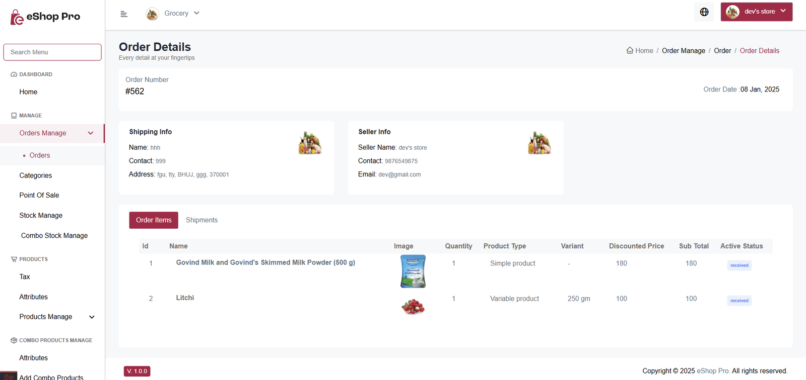
    </li>
    <li>
      To ship an order:
      <ul>
        <li>Click "Create a Parcel" button</li>
        <li>Select items to ship</li>
        <li>Create the parcel</li>
      </ul>
       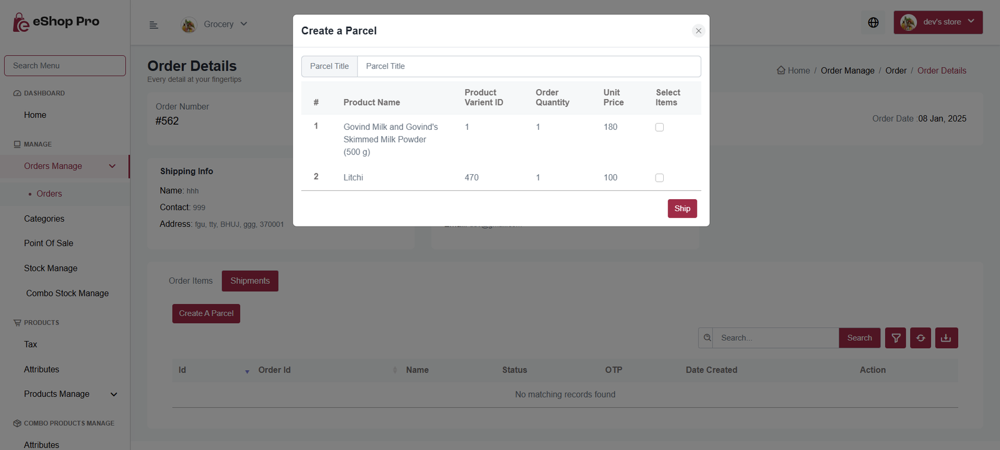
    </li>
    <li>
      Once created, parcels appear in a list with 4 actions:
      <ul>
        <li>View - See items in the parcel</li>
        <li>Invoice - View/download parcel invoice</li>
        <li>Update Status - Change shipping status</li>
        <li>Delete - Remove unshipped parcels only</li>
      </ul>
       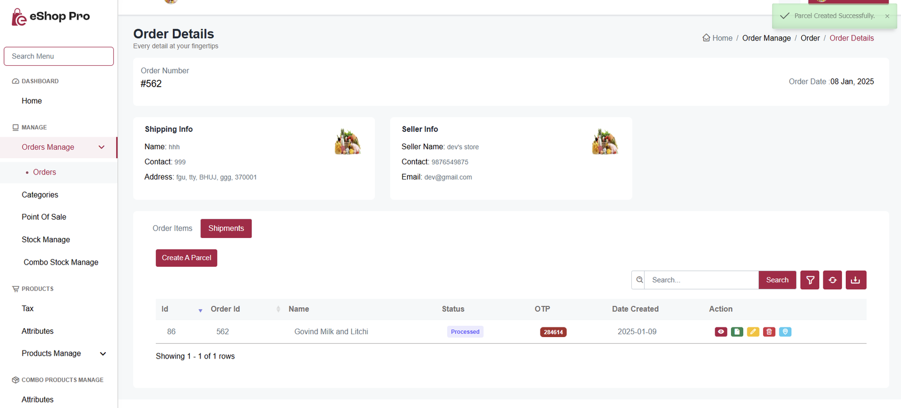
    </li>
    <li>
      For shipping status updates:
      <ul>
        <li>Click Update Status to open window</li>
        <li>For Local Shipping: Select delivery person and update status</li>
      </ul>
       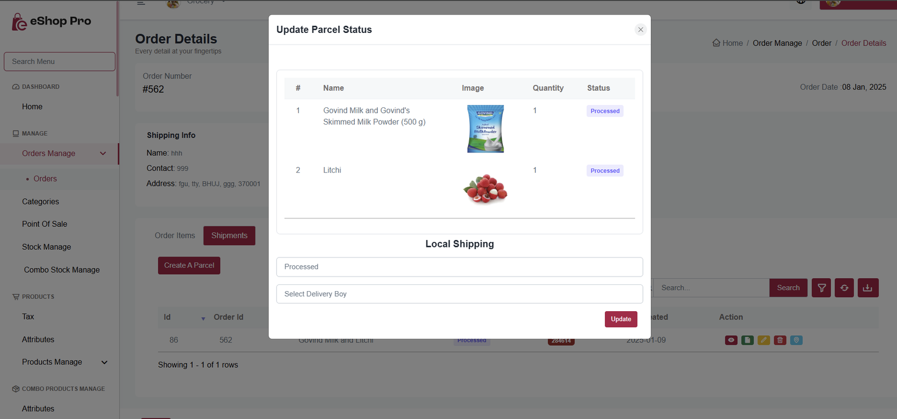
    </li>
  </ul>

  <h2>🔄 Return & Refund Process</h2>
  <ul className="feature-list">
    <li>Currently, the method for managing return parcels is manual.</li>
    <li>When a customer requests a return, the admin will receive the request, accept it, and mark the item as returned once the parcel is received</li>
    <li>Note: Sellers cannot update the status for returns.</li>
  </ul>
  
 
    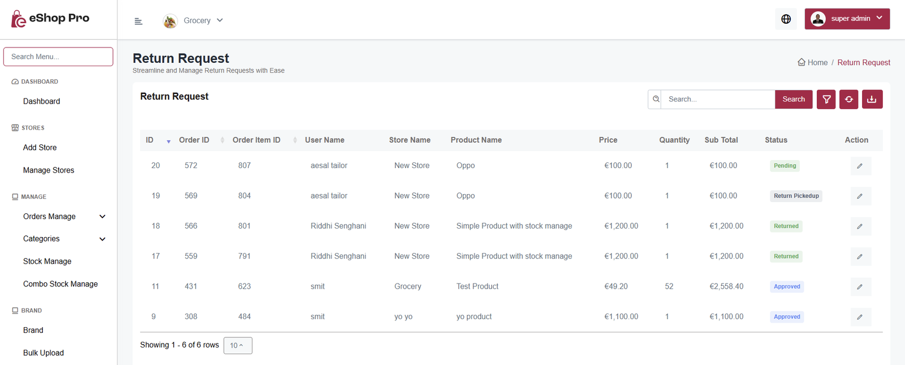
  

  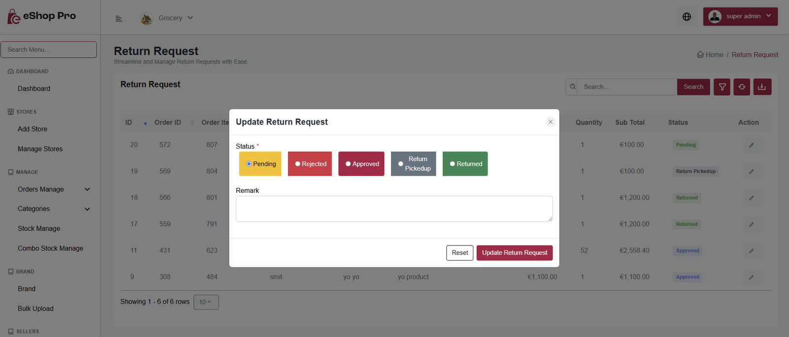

  <h2>üë• Seller Process</h2>
  
  <ul className="feature-list">
    <li>Sellers can select the categories in which they want to sell their products during registration.</li>
    <li>After registration, the seller is marked as not approved by default.</li>
    <li>The admin reviews the seller's details and selected categories.</li>
    <li>The admin can approve or reject the seller registration.</li>
    <li>The admin can also set a commission for the categories and also can add/remove categories from seller profile.</li>
  </ul>

  <h3>How to assign categories to sellers?</h3>
  <ol className="step-list">
    <li>Click on edit seller</li>
    <li>Add categories and commission and click on save and click on update</li>
  </ol>

  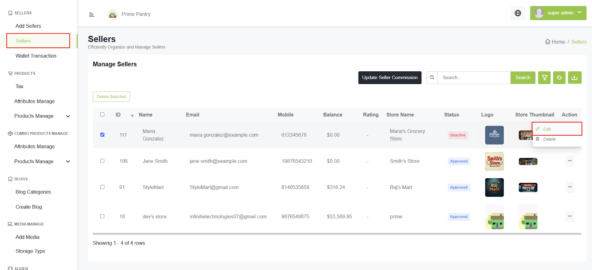
  
  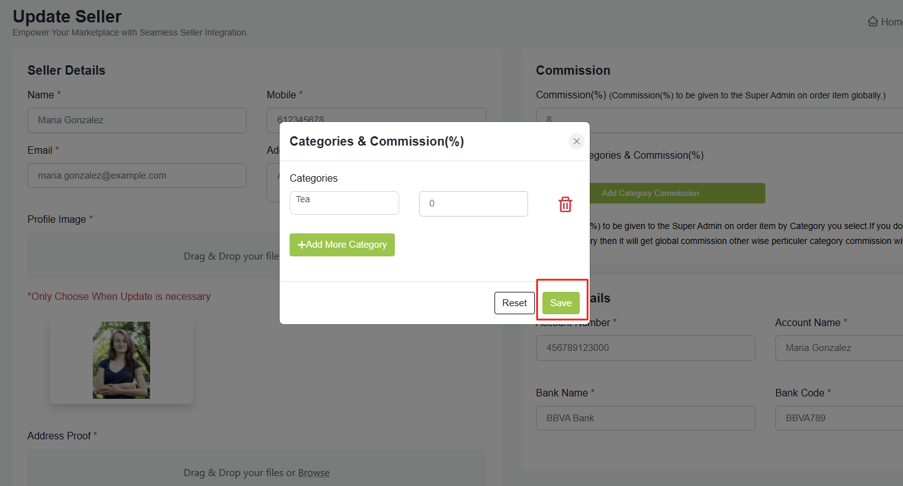

  

    <strong>Permission Setting:</strong> There is a permission setting for sellers that requires product approval. If enabled, the seller's products will be marked as Not Approved by default. The admin will review, verify, and approve the products before they are available for sale.
  

  <h4>Register the Same Seller in Multiple Stores</h4>
  <ul className="feature-list">
    <li>A seller can register using the same personal details for different stores.</li>
    <li>There is an option to register a seller on a different store from the Seller App.</li>
    <li>This allows the same seller to sell their products across multiple stores.</li>
  </ul>

  <h2>üí∞ Commission Management</h2>
  
  <ul className="feature-list">
    <li>First you have to set cron job</li>
    <li>Cron job must be set (For once in a day) on your server for seller commission to be work</li>
    <li>Cron job will run every midnight at 12:00 AM</li>
    <li>Formula for seller commision is Sub total (Excluding delivery charge) / 100 * seller commission percentage</li>
    <li>For example sub total is 1378 and seller commission is 20% then 1378 / 100 X 20 = 275.6 so 1378 - 275.6 = 1102.4 will get credited into seller's wallet</li>
    <li>If Order item's status is delivered then only the seller will get commission</li>
    <li>Ex - 1. Order placed on 11-Aug-21 and product return days are set to 0 so 11-Aug + 0 days = 11-Aug seller commission will get credited on 12-Aug-21 at 12:00 AM (Mid night)</li>
    <li>Ex - 2. Order placed on 11-Aug-21 and product return days are set to 7 so 11-Aug + 7 days = 18-Aug seller commission will get credited on 19-Aug-21 at 12:00 AM (Mid night)</li>
    <li>If the seller commission doesn't work, make sure the cron job is set properly and it is working. If you don't know how to set a cron job for once in a day please take help of server support or search for it</li>

    <li>Or you can manually set commission from admin panel</li>
  </ul>
  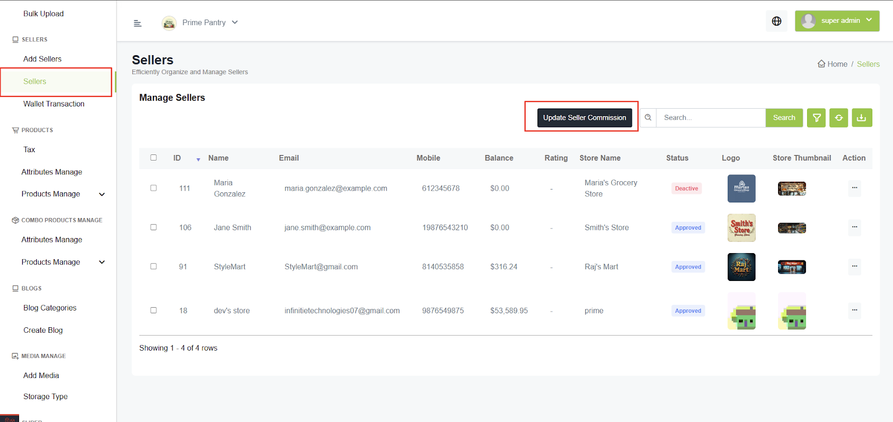

  <h2>üìä Stock Management</h2>
  
  <ul className="feature-list">
    <li>While adding products and combo products, there is an option to select the Product Type.</li>
  </ul>
  
  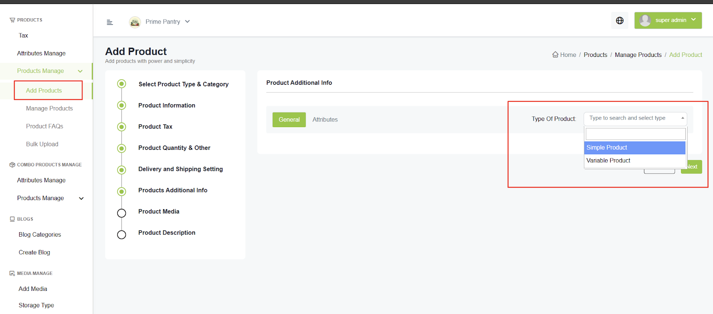
  
  <ul className="feature-list">
    <li>If it's a simple product, click on Enable Stock Management, add the details, and click Save Settings.</li>
  </ul>
  
  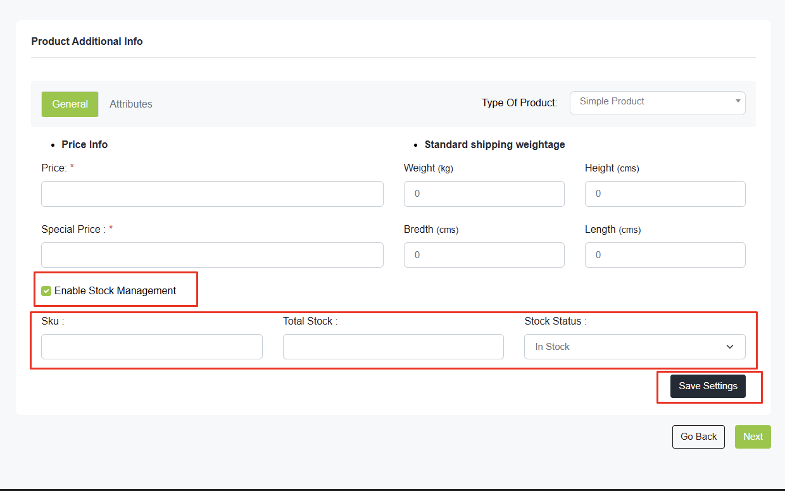
  
  <ul className="feature-list">
    <li>If it's a variable product, there are two types of stock management:</li>
    <li><strong>Product Level:</strong> Sets the same stock for all variants.</li>
    <li><strong>Variant Level:</strong> Manages stock for each variant separately. While adding variants, there is an option to set stock for each variant.</li>
  </ul>

  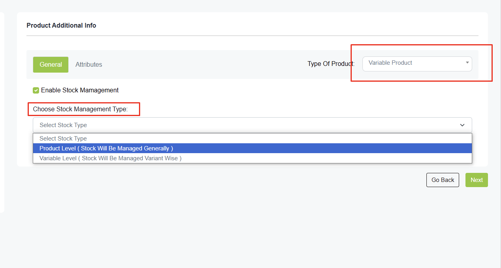

  <h2>üé´ Cashback Coupon Process</h2>
  
  <ul className="feature-list">
    <li>There is an option for cashback while adding a promo code.</li>
    <li>A cron job must be set up on your server for the promo code discount to work.</li>
    <li>The cron job runs every midnight at 12:00 AM.</li>
    <li>
      <strong>Formula for Promo Code Discount:</strong>
      <ul>
        <li>Subtotal (excluding delivery charges) - Promo code discount (percentage/amount)</li>
      </ul>
    </li>
    <li>
      <strong>Example:</strong>
      <ul>
        <li>If the subtotal is 1300 and the promo code discount is 100, then: 1300 - 100 = 1200</li>
        <li>100 will be credited to the user's wallet.</li>
      </ul>
    </li>
    <li>
      The promo code discount will be credited only if:
      <ul>
        <li>The order status is marked as delivered.</li>
        <li>The return policy period has expired.</li>
      </ul>
    </li>
    <li>
      <strong>Example:</strong>
      <ul>
        <li>Order placed on: 10-Sep-22</li>
        <li>Return policy days: 1 day</li>
        <li>Credit date: 11-Sep-22 at 12:00 AM (midnight)</li>
      </ul>
    </li>
    <li>
      <strong>Troubleshooting:</strong>
      <ul>
        <li>If the promo code discount is not working, ensure the cron job is set up correctly.</li>
        <li>If you're unsure how to set a cron job for once a day, seek help from server support or search online for guidance.</li>
      </ul>
    </li>
  </ul>

  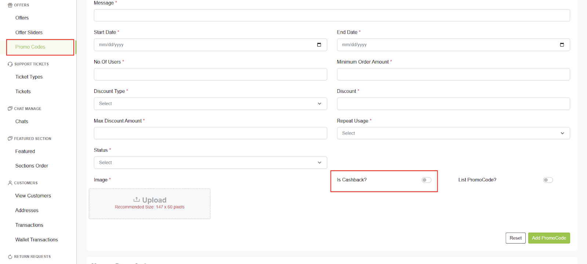

  

    <strong>Important:</strong> If you're unsure how to set a cron job for once a day, seek help from server support or search online for guidance.
  

  <h2>üí∏ Multi-Tax Option in Product Pricing</h2>
  
  <ul className="feature-list">
    <li>There is an option for multi-tax while adding a product.</li>
    <li>You can choose between price including tax or price excluding tax.</li>
    <li><strong>Price Including Tax:</strong> If you select "Price Including Tax," the system will calculate the tax amount separately and deduct it from the price accordingly.</li>
    <li><strong>Price Excluding Tax:</strong> If you select "Price Excluding Tax," the system will calculate the tax amount separately and add it to the price accordingly.</li>
  </ul>

  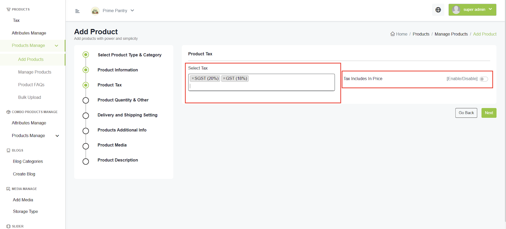

  <h2>üé® Variable Products</h2>
  
  
<strong>Steps to Add a Variable Product:</strong>

  <ol className="step-list">
    <li>Add Attributes & Values (e.g., Size (S, M, L) and Color (Red, Blue, Black))</li>
    <li>Select "Variable Product" while adding a product.</li>
    <li>Click on Attributes, choose the attributes, and click Save Settings.</li>
    <li>Go to the Variants Tab</li>
    <li>You will see the added attributes.</li>
    <li>Set price, stock details, and variant images for each combination</li>
    <li>Save the product, and it's done</li>
  </ol>

  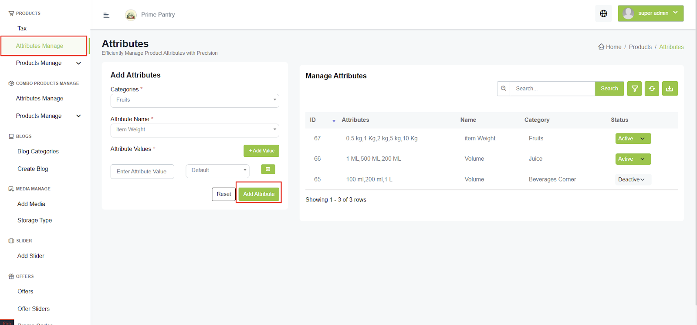
  
  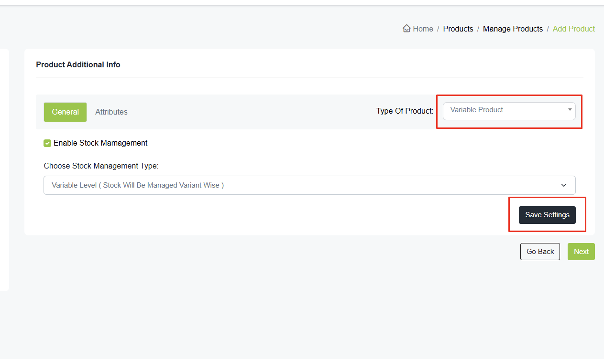
  
  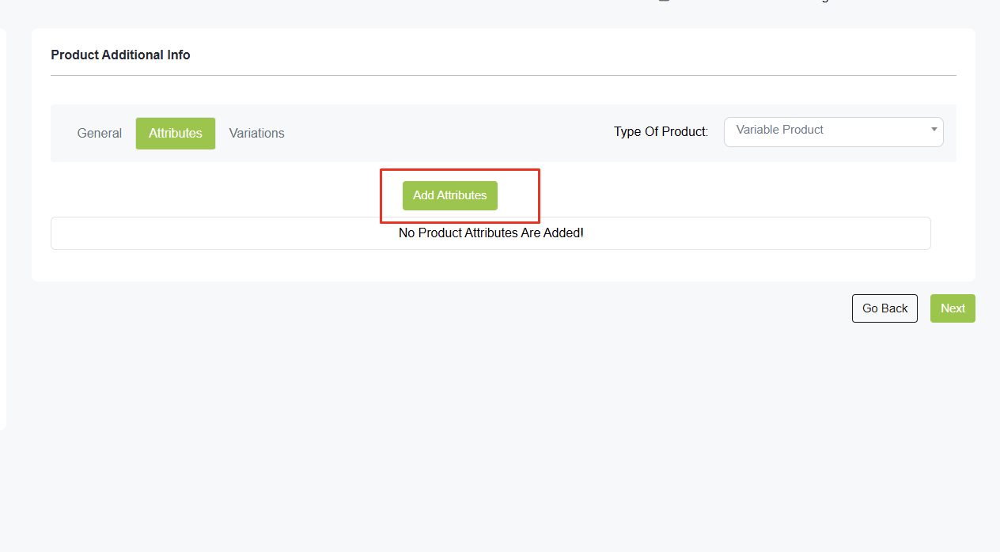
  
  
  
  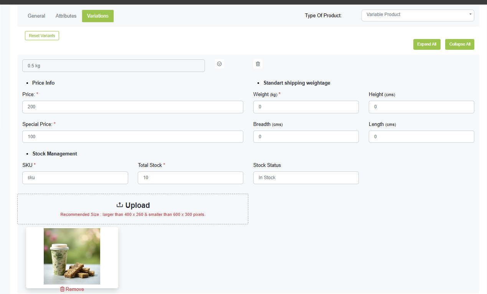

  <h2>üöö Cash Collection</h2>
  
  <ul className="feature-list">
    <li>The admin can collect the amount from the delivery boy from the cash collection.</li>
  </ul>

  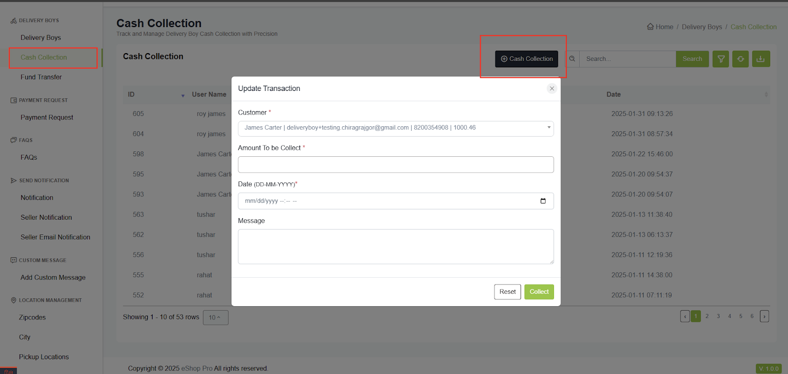

  <h2>üí≥ Fund Transfer</h2>
  
  <ul className="feature-list">
    <li>Used to settle the delivery boy's commission.</li>
  </ul>

  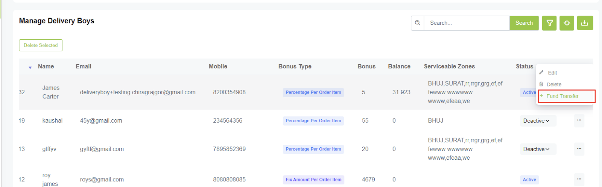
  
  <ul className="feature-list">
    <li>The admin manually pays the delivery boy and records the transaction as a Fund Transfer.</li>
  </ul>

  

  <h2>üí∏ Payment Request</h2>
  
  <ul className="feature-list">
    <li>Seller and admin can send withdrawal requests from their panel or app, and by default, it's set as pending. The admin can approve or reject it.</li>
  </ul>

  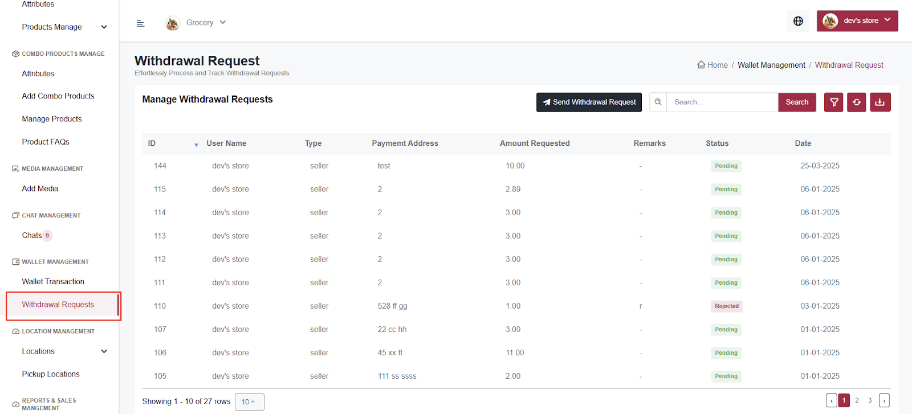
  
  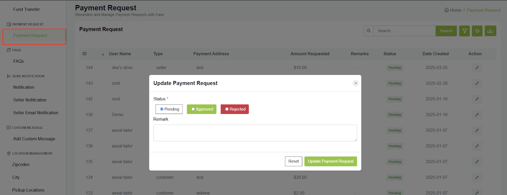

  <h2>🗺️ Zone Process</h2>
  
  
A zone is a combination of cities and zip codes. For example, if you add Zone One, it may include the cities ABC and XYZ, along with their respective zip codes.

  <ul className="feature-list">
    <li>To add a zone, you must first add the city and zipcode.</li>
    <li>After adding the city and zipcode, you can create the zone.</li>
  </ul>

  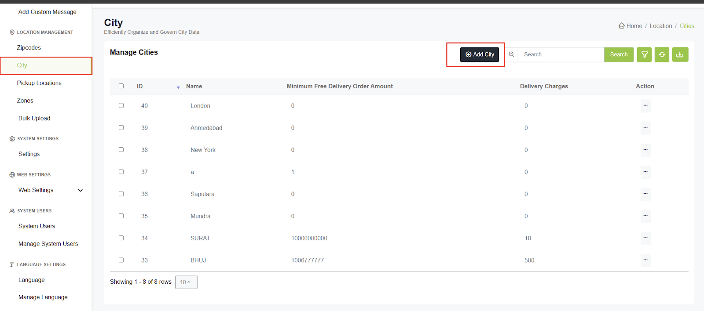
  
  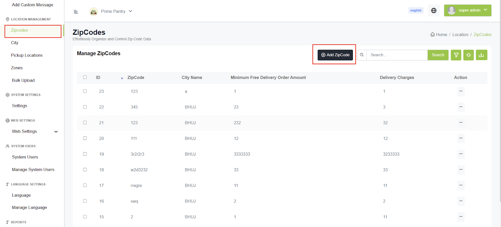
  
  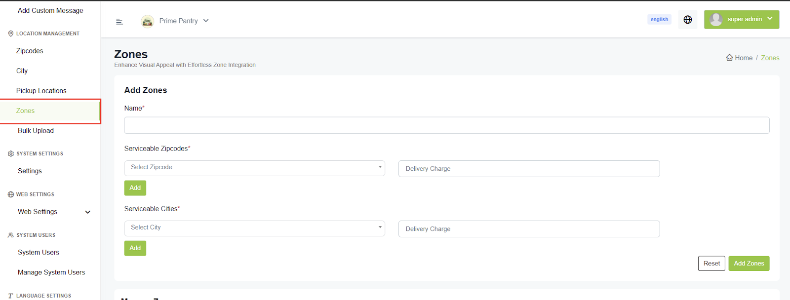

  <h2>📦 Product Deliverability Flow</h2>
  
  
While adding a store, there's an option for deliverability, which can be set either by zip code or city. This setting applies to all sellers registered in this store.

  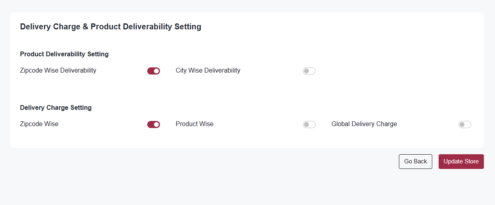
  
  <ul className="feature-list">
    <li>There's an option to add city, zip code, and zone in the location settings. You can add the zip code, city, and zone data from there.</li>
    <li>A zone is a combination of cities and zip codes. For example, if you add Zone One, it may include the cities ABC and XYZ, along with their respective zip codes.</li>
    <li>While adding a seller, you'll see an option to add the zones.</li>
    <li>While adding products, you'll see an option to choose a zone, which can be set to 'All Zones,' specific, if seller has selected limited zones so it will show seller's selected zones while add product or if seller selected all zones than in product it show all zones.</li>
    <li>While adding a delivery boy, there's an option to choose the zones where the delivery boy will deliver products.</li>
    <li>Based on the seller's zone, the delivery boy's zone, and the user's city or zipcode, it will check whether the product is deliverable to the user's address. If the store's deliverability setting is set to zip code-wise, it will check the seller's zip code against the user's zip code. If it's set to city-wise, it will check the city.</li>
  </ul>

  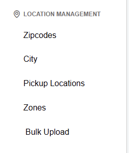
  
  
  
  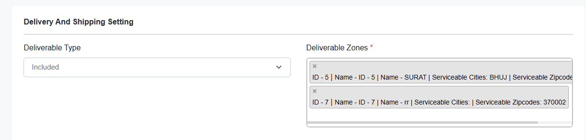
  
  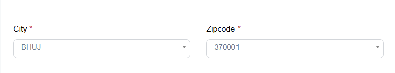

  <h2>üîî Push Notifications</h2>
  
  
<strong>Step 1: Create Pusher Account</strong>

  <ol className="step-list">
    <li>Go to <a href="https://pusher.com/" className="link-button">https://pusher.com/</a></li>
    <li>Sign up for a free account</li>
    <li>Navigate to <a href="https://dashboard.pusher.com/apps" className="link-button">https://dashboard.pusher.com/apps</a></li>
    <li>Click on Create App and create your app</li>
    <li>After creating the app, go to <a href="https://dashboard.pusher.com/apps" className="link-button">https://dashboard.pusher.com/apps</a></li>
    <li>Select your app</li>
    <li>Go to "App Keys" and copy the values</li>
    <li>Open the admin panel, go to Settings ‚Üí Pusher Settings</li>
    <li>Paste the values of channel name, app ID, pusher key, pusher secret key, and cluster in the respective fields</li>
  </ol>

  
  
  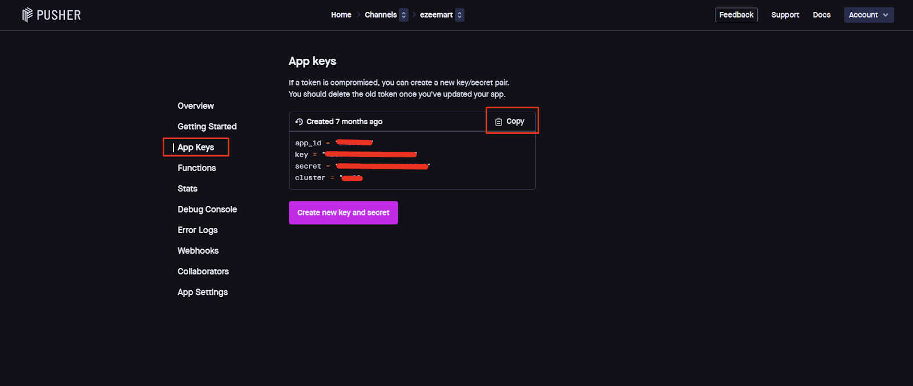
  
  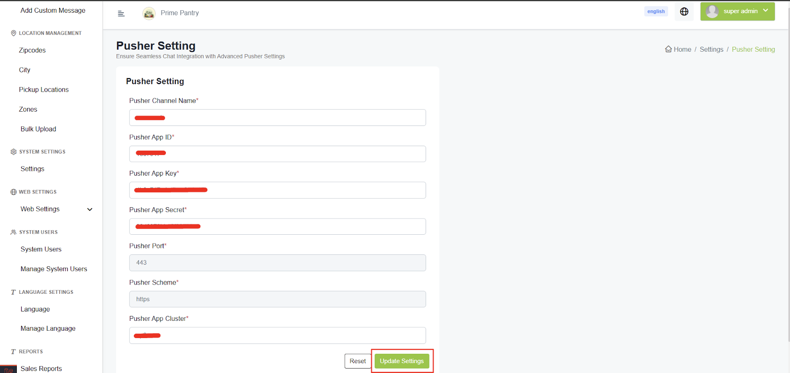

  <h2>üìß SMTP Configuration</h2>
  
  
<strong>Step 1: Gmail SMTP Settings</strong>

  <ul className="feature-list">
    <li>SMTP Host: smtp.gmail.com</li>
    <li>SMTP Port: 587</li>
    <li>Encryption: TLS</li>
    <li>Username: Your Gmail address</li>
    <li>Password: Your App Password (not your regular Gmail password)</li>
  </ul>

  
<strong>Step 2: Create App Password</strong>

  <ul className="feature-list">
    <li>Go to your Google Account and navigate to Security on the left panel</li>
    <li>Alternatively, follow this <a href="https://www.google.com/url?q=https://myaccount.google.com/apppasswords&sa=D&source=docs&ust=1750081650297593&usg=AOvVaw2WqFnF2bW_wP3Qs7rHC2q-" className="link-button">link</a> for the App Password setup</li>
    <li>Under the Signing into Google section, select App Passwords</li>
    <li>Click Select app and choose the app you are using</li>
    <li>Click Select device and choose your device</li>
    <li>Click Generate</li>
    <li>Follow the instructions to enter the 16-character App Password displayed in the yellow bar on your device</li>
    <li>Click Done</li>
  </ul>

  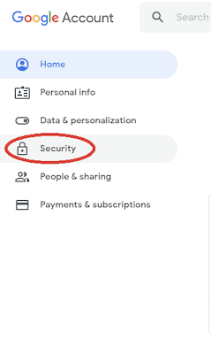
  
  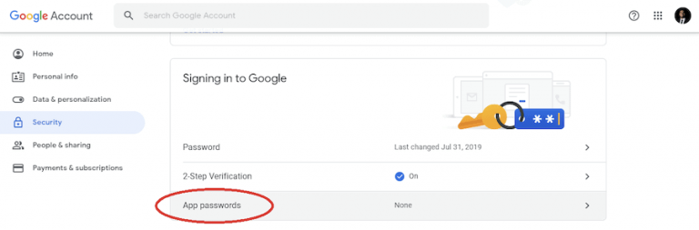
  
  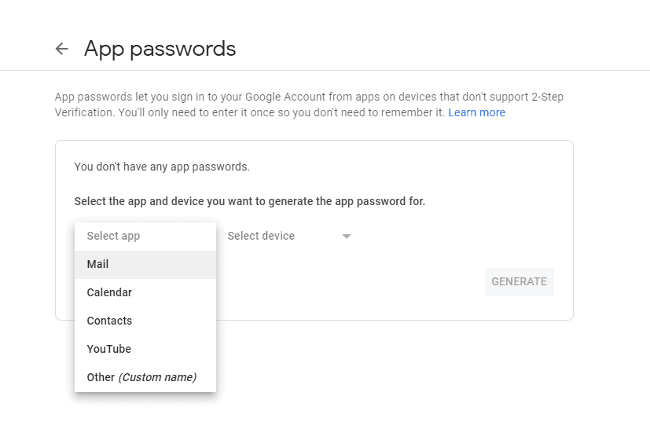
  
  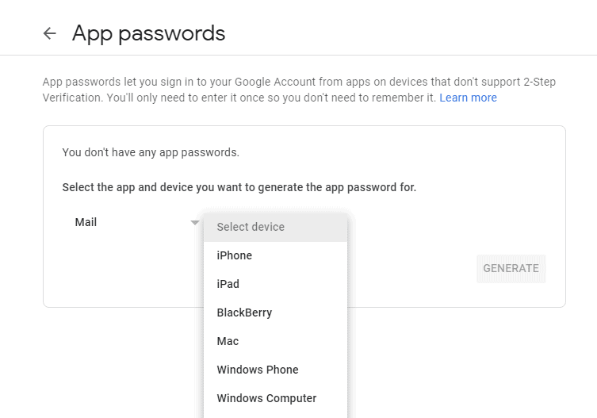
  
  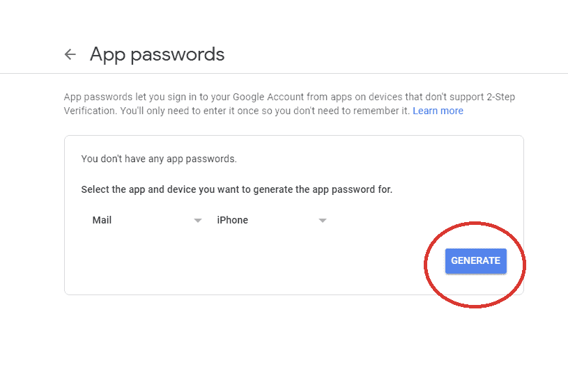
  
  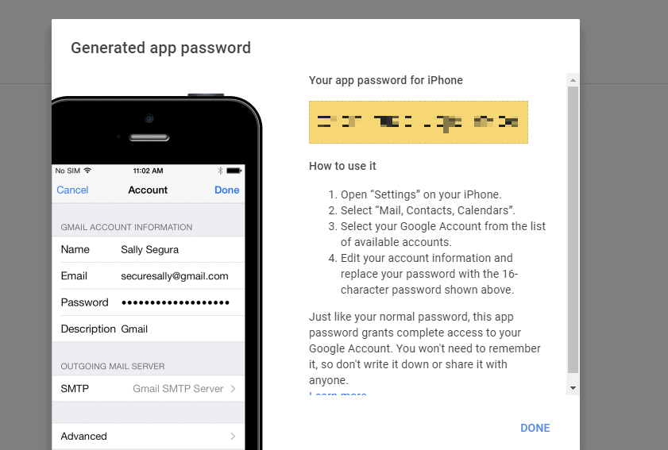

  
<strong>Step 3: Test the SMTP Configuration</strong>

  <ul className="feature-list">
    <li>Use the designated <a href="https://www.gmass.co/smtp-test" className="link-button">testing link</a> to verify your SMTP settings</li>
    <li>If you receive the test email successfully, navigate to Settings ‚Üí SMTP Settings and configure your SMTP details accordingly</li>
  </ul>

  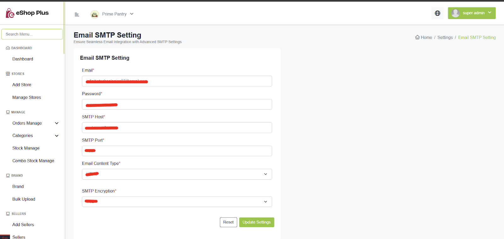

  <h2>üî• Firebase Configuration</h2>
  
  
<strong>Step 1: Create Firebase Project</strong>

  <ul className="feature-list">
    <li>Login into Firebase - <a href="https://console.firebase.google.com/" className="link-button">Firebase Console</a></li>
    <li>Click on Console ‚Üí Create Project</li>
    <li>After creating the project, go to Settings and copy the Project ID</li>
    <li>Paste the Project ID in the admin panel</li>
  </ul>

  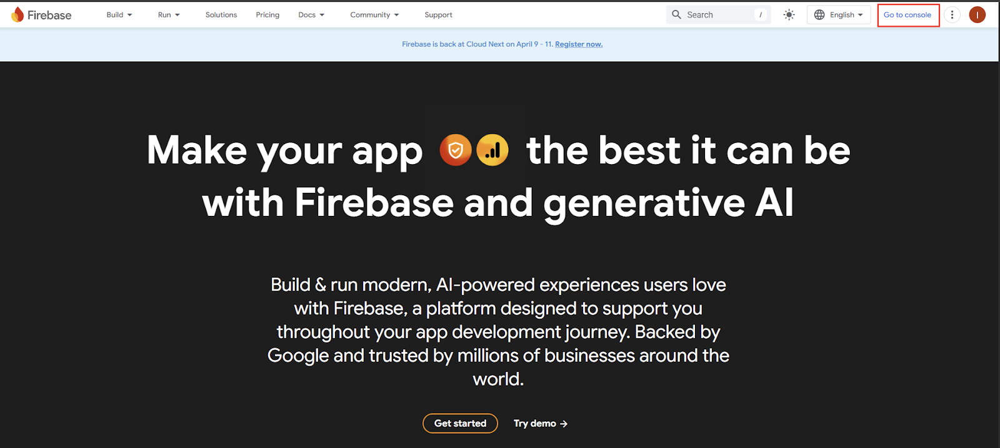
  
  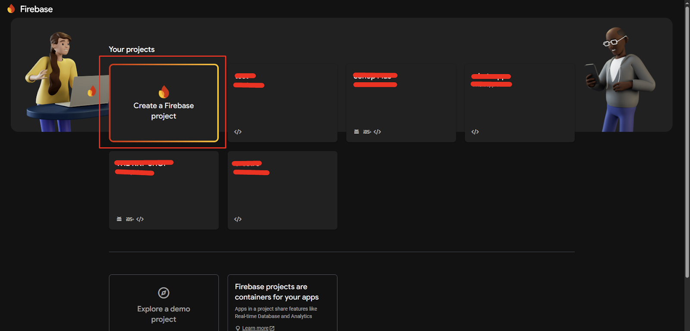
  
  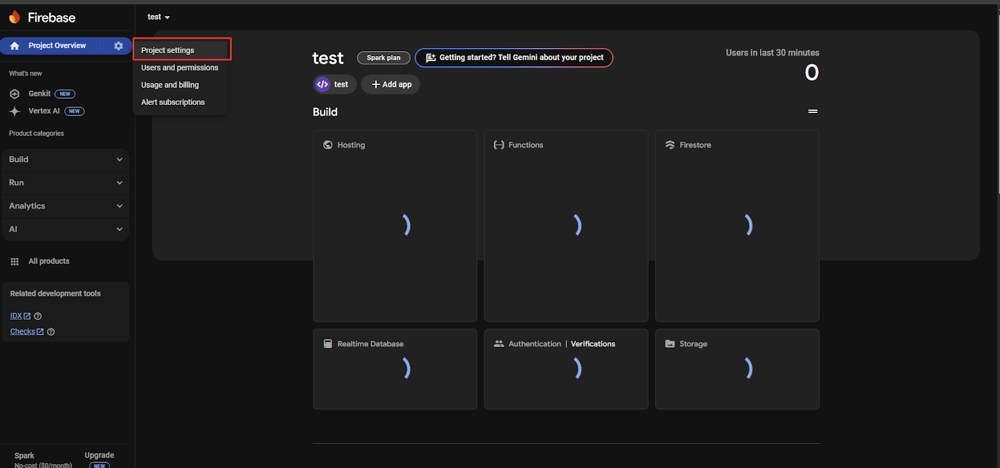
  
  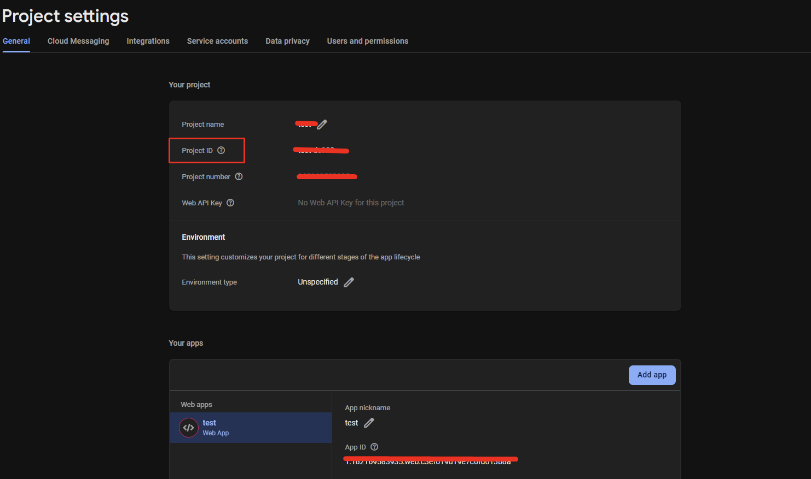
  
  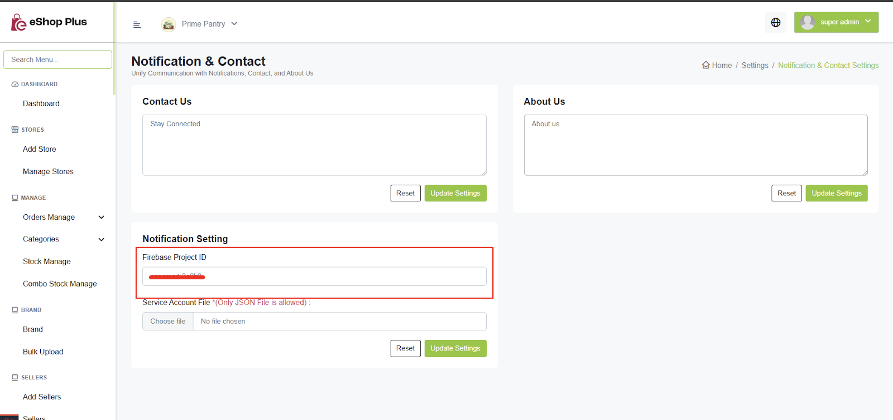

  
<strong>Step 2: Generate Service JSON File</strong>

  <ul className="feature-list">
    <li>Download the Firebase JSON file by opening your Firebase Project ‚Üí Project Settings ‚Üí Service Accounts</li>
    <li>Click Generate New Key</li>
    <li>Upload the downloaded Service JSON file in the admin panel</li>
  </ul>

  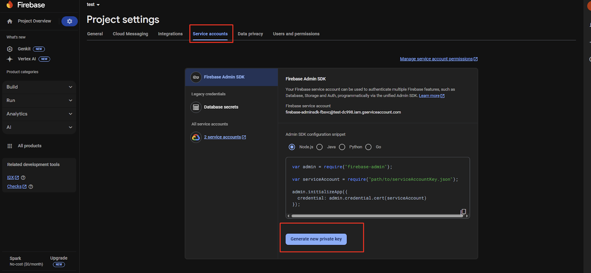
  
  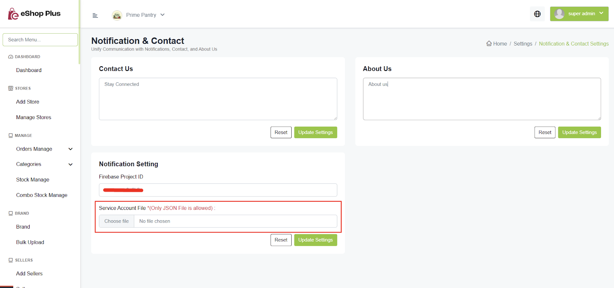

 